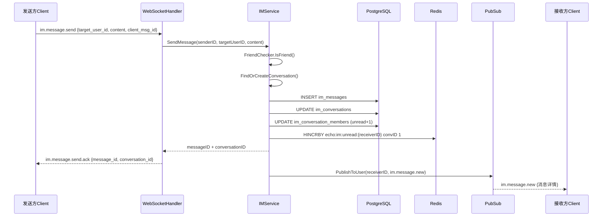

# Phase 2b 设计文档：即时通讯消息系统（单聊）

> **状态：** ✅ 已完成（含代码审查修复）
> **分支：** `feature/phase2b-instant-messaging`
> **前置依赖：** Phase 2a 全部完成（WebSocket + 联系人管理）
> **架构备忘：** `docs/plans/2026-03-02-phase2b-architecture-notes.md`
> **最后更新：** 2026-03-03（含代码审查修复 7 项 + 用户测试修复 8 项 + 文档同步）

---

## 一、设计目标

基于 Phase 2a 的 WebSocket 基础设施，实现单聊即时通讯核心功能，打通端到端消息收发链路。

**核心交付物：**
- 会话管理（创建/列表/置顶/删除/清空）
- 消息收发（全双工 WebSocket，三态 ACK 确认）
- 离线消息推送（WS 连接后服务端主动推送未读摘要）
- 消息撤回（2 分钟内）
- "正在输入"实时提示
- 未读消息展示（会话 badge + TabBar 总未读数）
- 全局消息搜索
- 前台 4 个页面：会话列表 + 聊天页 + 会话设置 + 消息搜索

**不包含（留待 Phase 2c）：**
- 群聊
- 已读回执
- 图片/语音/文件消息
- 管理端消息管理

---

## 二、需求确认汇总

| 决策项 | 选择 |
|--------|------|
| 范围 | 单聊核心，群聊/已读回执放 Phase 2c |
| 消息通道 | 全双工 WebSocket（发送 + 接收都走 WS） |
| 消息类型 | 仅文本，预留 type + extra JSON 字段 |
| 管理端 | 暂不做消息管理 |
| 正在输入 | 包含 |
| 前端页面 | 4 个：会话列表 + 聊天页 + 会话设置 + 消息搜索 |
| 会话创建 | 发第一条消息时自动创建（无空会话） |
| 离线消息 | 服务端 WS 连接后主动推送未读消息 |
| 消息状态 | 三态：发送中 → 已发送(ACK) → 发送失败 |
| 消息撤回 | 支持（2 分钟内） |
| 未读展示 | 会话 badge + TabBar 总未读数 |
| 会话操作 | 置顶 + 删除 + 清空聊天记录 |
| 联系人联动 | 好友详情页"发消息"按钮 + 列表项点击进入聊天 |
| 会话设置 | 对方信息卡片 + 置顶 + 清空 + 删除 |
| 消息搜索 | 全局搜索，结果按会话分组 |
| WS 事件路由 | 事件路由表 `map[string]EventHandler` |
| 分支 | `feature/phase2b-instant-messaging` |

---

## 三、架构方案

### 3.1 消息收发核心链路

```
发送方 Client
    │ WS: im.message.send { target_user_id, content, client_msg_id }
    ▼
WebSocket Handler（事件路由表分发）
    │ → IM MessageHandler.HandleSendMessage()
    ▼
IM Service.SendMessage()
    ├── FriendChecker.IsFriend() 校验好友关系
    ├── FindOrCreateConversation() 查找/创建会话
    ├── DB: INSERT im_messages
    ├── DB: UPDATE im_conversations (last_message 信息)
    ├── DB: UPDATE im_conversation_members (接收方 unread_count +1)
    └── Redis: HINCRBY echo:im:unread:{receiverID} convID 1
    │
    ├──→ WS Response: im.message.send.ack { message_id, conversation_id }
    │    （返回给发送方，确认消息已存储）
    │
    └──→ PubSub.PublishToUser(receiverID, im.message.new)
         （推送给接收方，实时展示新消息）
```

### 3.2 WS 事件路由表机制

Phase 2a 的 `handler.go` 使用 switch-case 分发事件（仅心跳）。Phase 2b 引入事件路由表，支持模块化注册：

```go
// EventHandler WS 事件处理函数签名
type EventHandler func(client *Client, msg *Message)

// Hub 新增字段
eventHandlers map[string]EventHandler

// RegisterEvent 注册事件处理器
func (h *Hub) RegisterEvent(event string, handler EventHandler)

// DispatchEvent 分发事件（onMessage 中优先查路由表，未命中走原 switch-case）
func (h *Hub) DispatchEvent(client *Client, msg *Message) bool
```

IM 模块在启动时向 Hub 注册事件：`im.message.send`、`im.message.recall`、`im.conversation.read`、`im.typing`。

### 3.3 离线消息推送

```
用户 WS 连接成功
    → OnlineService.UserOnline()
    → IMService.PushOfflineMessages(userID)
        ├── 查询 unread_count > 0 的所有会话
        └── PubSub.PublishToUser: im.conversation.unread 事件
            { conversations: [{ id, unread_count, last_msg_content, last_msg_time, ... }] }
```

前端收到 `im.conversation.unread` 后更新会话列表和 TabBar 未读数。

### 3.4 消息撤回链路

```
发送方 Client
    │ WS: im.message.recall { message_id }
    ▼
IM Service.RecallMessage()
    ├── 校验：是否为自己的消息、是否在 2 分钟内
    ├── DB: UPDATE im_messages SET status = 2(已撤回)
    ├── 若被撤回的是会话最后一条消息 → UPDATE im_conversations (last_msg_content = "XX 撤回了一条消息")
    ├── WS Response: im.message.recall.ack { message_id }
    └── PubSub.PublishToUser(receiverID, im.message.recalled { message_id, conversation_id, sender_id })
```

### 3.5 消息收发时序图



### 3.6 跨模块依赖（接口注入模式）

沿用 Phase 2a 的接口注入标准，避免 `im` 包直接 import `contact` 包：

```go
// 定义在 app/im/ 包内
type FriendChecker interface {
    IsFriend(ctx context.Context, userID, targetID int64) (bool, error)
}

type UserInfoGetter interface {
    GetUsersByIDs(ctx context.Context, userIDs []int64) ([]model.AuthUser, error)
}
```

Wire 注入链：`contact.FriendshipDAO` 隐式实现两个接口。

离线消息推送需要 `ws` 模块调用 IM：定义 `OfflineMessagePusher` 接口在 `app/ws/` 中，由 `IMService` 实现。

---

## 四、数据库设计

### 4.1 im_conversations（会话表）

```sql
CREATE TABLE im_conversations (
    id                 BIGSERIAL PRIMARY KEY,
    type               SMALLINT NOT NULL DEFAULT 1,     -- 1=单聊（预留 2=群聊）
    creator_id         BIGINT NOT NULL,                 -- 创建者 ID
    last_message_id    BIGINT DEFAULT NULL,             -- 最后一条消息 ID
    last_msg_content   TEXT DEFAULT '',                 -- 最后消息预览文本
    last_msg_time      TIMESTAMP WITH TIME ZONE,        -- 最后消息时间
    last_msg_sender_id BIGINT DEFAULT NULL,             -- 最后消息发送者
    created_at         TIMESTAMP WITH TIME ZONE DEFAULT NOW(),
    updated_at         TIMESTAMP WITH TIME ZONE DEFAULT NOW()
);

CREATE INDEX idx_im_conversations_updated ON im_conversations(updated_at DESC);
```

### 4.2 im_conversation_members（会话成员表）

```sql
CREATE TABLE im_conversation_members (
    id                  BIGSERIAL PRIMARY KEY,
    conversation_id     BIGINT NOT NULL REFERENCES im_conversations(id),
    user_id             BIGINT NOT NULL,                 -- 成员用户 ID
    is_pinned           BOOLEAN DEFAULT FALSE,           -- 是否置顶
    is_deleted          BOOLEAN DEFAULT FALSE,           -- 是否删除会话（软删除，不影响对方）
    unread_count        INT DEFAULT 0,                   -- 未读消息数
    last_read_msg_id    BIGINT DEFAULT 0,                -- 最后已读消息 ID
    clear_before_msg_id BIGINT DEFAULT 0,                -- 清空记录截止消息 ID（个人视图，不影响对方）
    created_at          TIMESTAMP(0) NOT NULL DEFAULT NOW(),
    updated_at          TIMESTAMP(0) NOT NULL DEFAULT NOW(),

    UNIQUE(conversation_id, user_id)
);

CREATE INDEX idx_im_conv_members_user ON im_conversation_members(user_id, is_deleted);
CREATE INDEX idx_im_conv_members_conv ON im_conversation_members(conversation_id);
```

> **设计说明**：`clear_before_msg_id` 用于实现"清空聊天记录"的个人视图。用户 A 清空记录后，仅 A 看不到清空前的消息，用户 B 不受影响。查询历史消息时增加 `id > clear_before_msg_id` 过滤条件。

### 4.3 im_messages（消息表）

```sql
CREATE TABLE im_messages (
    id              BIGSERIAL PRIMARY KEY,
    conversation_id BIGINT NOT NULL REFERENCES im_conversations(id),
    sender_id       BIGINT NOT NULL,                 -- 发送者 ID
    type            SMALLINT NOT NULL DEFAULT 1,     -- 1=文本（预留 2=图片 3=语音...）
    content         TEXT NOT NULL,                   -- 消息内容
    extra           JSONB DEFAULT NULL,              -- 扩展数据（预留）
    status          SMALLINT NOT NULL DEFAULT 1,     -- 1=正常 2=已撤回 3=已删除
    client_msg_id   VARCHAR(64) DEFAULT '',          -- 客户端消息唯一 ID（幂等用）
    created_at      TIMESTAMP WITH TIME ZONE DEFAULT NOW()
);

-- 游标分页核心索引
CREATE INDEX idx_im_messages_conv_time ON im_messages(conversation_id, created_at DESC);
CREATE INDEX idx_im_messages_conv_id ON im_messages(conversation_id, id DESC);
-- 全局消息搜索索引
CREATE INDEX idx_im_messages_content_search ON im_messages USING gin(to_tsvector('simple', content));
```

### 4.4 单聊会话去重

Service 层通过查询 `im_conversation_members` 判断两人间是否已存在单聊会话：

```sql
SELECT cm1.conversation_id FROM im_conversation_members cm1
JOIN im_conversation_members cm2 ON cm1.conversation_id = cm2.conversation_id
JOIN im_conversations c ON c.id = cm1.conversation_id
WHERE cm1.user_id = ? AND cm2.user_id = ? AND c.type = 1
LIMIT 1
```

### 4.5 Redis 数据结构

| Key | 类型 | 说明 |
|-----|------|------|
| `echo:im:unread:{user_id}` | STRING | 全局未读消息总数（会话级别的未读数存储在 DB `im_conversation_members.unread_count`） |

- 收到新消息：`INCR echo:im:unread:{user_id}`（全局 +1）
- 标记已读/清空/删除会话：Lua 脚本原子递减（下限为 0，防止负数）
- 获取总未读数：`GET echo:im:unread:{user_id}`

> **设计说明**：选择 STRING 而非 HASH 的原因：DB 已有会话级别的 `unread_count` 字段，Redis 仅用于 TabBar badge 的快速读取，不需要冗余存储每个会话的未读数。Lua 脚本保证递减操作的原子性和下限保护。

---

## 五、WebSocket 事件协议

### 5.1 客户端 → 服务端（发送类）

| 事件 | 说明 | Data 字段 |
|------|------|-----------|
| `im.message.send` | 发送消息 | `{ conversation_id, target_user_id, content, type, client_msg_id }` |
| `im.message.recall` | 撤回消息 | `{ message_id }` |
| `im.conversation.read` | 标记已读 | `{ conversation_id }` |
| `im.typing` | 正在输入 | `{ conversation_id }` |

> **说明**：`im.message.send` 中 `conversation_id` 和 `target_user_id` 二选一。首次发消息时使用 `target_user_id`（自动创建会话），后续使用 `conversation_id`。

### 5.2 服务端 → 客户端（ACK 响应）

使用现有 `Response` 结构体（`event` + `.ack` 后缀）：

| 事件 | 说明 | Data 字段 |
|------|------|-----------|
| `im.message.send.ack` | 发送成功确认 | `{ message_id, conversation_id, created_at }` |
| `im.message.recall.ack` | 撤回成功确认 | `{ message_id }` |

### 5.3 服务端 → 客户端（推送类）

使用现有 `PushMessage` 结构体：

| 事件 | 说明 | Data 字段 |
|------|------|-----------|
| `im.message.new` | 新消息推送 | `{ id, conversation_id, sender_id, sender_name, sender_avatar, type, content, client_msg_id, created_at }` |
| `im.message.recalled` | 消息被撤回 | `{ message_id, conversation_id, sender_id }` |
| `im.typing` | 正在输入通知 | `{ conversation_id, user_id }` |
| `im.offline.sync` | 离线未读摘要 | `{ total_unread, conversations: [{ conversation_id, unread_count, last_msg_content, last_msg_time }] }` |

> **说明**：正在输入通知前端收到后设置 3 秒超时自动清除。离线同步事件在 WS 连接成功后由服务端主动推送。

---

## 六、REST API 设计（查询类）

所有查询类操作仍走 REST，前缀 `/api/v1/im/`：

| 方法 | 路径 | 说明 |
|------|------|------|
| GET | `/conversations` | 获取会话列表（含未读数、最后消息、对方信息） |
| GET | `/messages?conversation_id=xx&before_id=xx&limit=30` | 获取历史消息（游标分页） |
| PUT | `/conversations/:id/pin` | 置顶/取消置顶 |
| DELETE | `/conversations/:id` | 删除会话（软删除） |
| DELETE | `/conversations/:id/messages` | 清空聊天记录（个人视图，不影响对方） |
| GET | `/messages/search?keyword=xxx&limit=50` | 全局消息搜索（GIN 全文索引） |
| GET | `/unread` | 获取全局未读消息总数 |

共 **7 个 REST API**，均需 JWT 认证。标记已读通过 WS 事件 `im.conversation.read` 实现。

---

## 七、后端模块设计

### 7.1 IM 模块目录结构

```
app/im/
├── controller/
│   └── im_controller.go           # REST API 控制器
├── service/
│   └── im_service.go              # 核心业务逻辑
├── dao/
│   ├── conversation_dao.go        # 会话 CRUD
│   └── message_dao.go             # 消息 CRUD + 搜索
├── model/
│   ├── conversation.go            # im_conversations GORM 模型
│   ├── conversation_member.go     # im_conversation_members 模型
│   └── message.go                 # im_messages 模型
├── handler/
│   └── message_handler.go         # WS 事件处理器
├── router.go                      # REST 路由注册
└── provider.go                    # Wire ProviderSet
```

### 7.2 依赖注入设计

```go
type IMService struct {
    conversationDAO *dao.ConversationDAO
    messageDAO      *dao.MessageDAO
    pubsub          *ws.PubSub          // 复用 Phase 2a
    rdb             *redis.Client       // Redis 操作（未读数 HASH）
    friendChecker   FriendChecker       // 接口注入 → FriendshipDAO.IsFriend
    userInfoGetter  UserInfoGetter      // 接口注入 → FriendshipDAO.GetUsersByIDs
}
```

Wire 注入链：
- `contact.FriendshipDAO` → 隐式实现 `FriendChecker` + `UserInfoGetter`
- `*redis.Client` → 直接注入（已在 InfraSet 中提供）

### 7.3 IMService 核心方法

| 方法 | 说明 |
|------|------|
| `SendMessage(ctx, senderID, targetUserID, content, clientMsgID)` | 发送消息（含创建会话、写库、推送） |
| `RecallMessage(ctx, userID, messageID, conversationID)` | 撤回消息 |
| `GetConversations(ctx, userID)` | 获取会话列表 |
| `GetMessages(ctx, userID, conversationID, beforeID, limit)` | 获取历史消息（游标分页） |
| `PinConversation(ctx, userID, conversationID, isPinned)` | 置顶/取消置顶 |
| `DeleteConversation(ctx, userID, conversationID)` | 删除会话（软删除） |
| `ClearMessages(ctx, userID, conversationID)` | 清空聊天记录（个人视图，ClearBeforeMsgID） |
| `MarkAsRead(ctx, userID, conversationID)` | 标记已读 |
| `SearchMessages(ctx, userID, keyword)` | 全局搜索 |
| `PushOfflineMessages(ctx, userID)` | 推送离线未读摘要 |
| `FindOrCreateConversation(ctx, userID, targetUserID)` | 查找/创建单聊会话 |

---

## 八、前端设计

### 8.1 页面结构

```
frontend/src/pages/chat/
├── index.vue         # 会话列表页（消息 Tab 主页面）
├── conversation.vue  # 聊天页（消息收发界面）
├── settings.vue      # 会话设置页
└── search.vue        # 消息搜索页
```

### 8.2 Store 设计（store/chat.js）

**状态：**
- `conversations`：会话列表（按置顶 + 最后消息时间排序）
- `currentConversation`：当前打开的会话
- `messages`：当前会话的消息列表（内存缓存最新 N 条）
- `totalUnread`：总未读消息数
- `typingUsers`：正在输入的用户 Map

**Actions：**
- `loadConversations()`：REST 拉取会话列表
- `sendMessage(targetUserId, content)`：WS 发送消息
- `loadHistory(conversationId, beforeId)`：REST 拉取历史消息
- `markAsRead(conversationId)`：标记已读 + 清 Redis
- `recallMessage(messageId, conversationId)`：撤回消息
- `pinConversation(id, isPinned)`：置顶/取消置顶
- `deleteConversation(id)`：删除会话
- `clearMessages(id)`：清空聊天记录
- `searchMessages(keyword)`：全局搜索

**WS 事件监听：**
- `im.message.new` → 更新 conversations + messages + totalUnread
- `im.message.recalled` → 更新消息状态为"已撤回"
- `im.typing` → 更新 typingUsers（3 秒自动清除）
- `im.offline.sync` → 初始化未读数 + 刷新会话列表

### 8.3 API 封装（api/chat.js）

封装 7 个 REST API 的请求函数。

### 8.4 页面功能描述

**会话列表页 (index.vue)**：
- 顶部搜索栏（跳转消息搜索页）
- 会话列表：头像 + 昵称 + 最后消息预览 + 时间 + 未读 badge + 置顶标记
- 长按操作菜单：置顶/取消置顶、删除会话、清空聊天记录
- 空状态提示（"暂无消息，去找好友聊聊吧"）

**聊天页 (conversation.vue)**：
- 顶部导航：对方昵称 + "正在输入…"指示 + 设置入口
- 消息列表：支持向上滚动加载历史消息
- 消息气泡：自己（右侧蓝）/ 对方（左侧灰）
- 消息状态图标：发送中(loading) / 已发送(check) / 失败(retry 可重发)
- 长按消息：撤回（2 分钟内自己的消息）
- 底部输入区：文本框 + 发送按钮
- 输入时自动触发 typing 事件（节流 3s）

**会话设置页 (settings.vue)**：
- 对方信息卡片（头像 + 昵称 + 用户名）
- 置顶聊天开关
- 清空聊天记录按钮（二次确认）
- 删除会话按钮（二次确认）

**消息搜索页 (search.vue)**：
- 搜索输入框（防抖 300ms）
- 搜索结果按会话分组展示（每组：会话名 + 匹配消息摘要列表）
- 点击结果跳转到对应聊天页

所有前端页面使用 **ui-ux-pro-max** 技能包进行设计和开发。

---

## 九、联系人模块改造

### 9.1 好友详情页 (contact/detail.vue)

将现有 `sendMessage()` 占位方法改为跳转聊天页：

```javascript
const sendMessage = () => {
  uni.navigateTo({ url: `/pages/chat/conversation?userId=${friend.value.user_id}` })
}
```

### 9.2 好友列表页 (contact/index.vue)

好友列表项添加点击事件，点击直接跳转到聊天页。

### 9.3 CustomTabBar 改造

- 新增消息 Tab（跳转 `/pages/chat/index`）
- 消息 Tab 添加未读数 badge（从 `chatStore.totalUnread` 读取）

---

## 十、关键设计决策

| # | 决策 | 选择 | 理由 |
|---|------|------|------|
| 1 | 事件路由表 vs switch-case | 事件路由表 | 模块化注册，便于后续 Phase 扩展 |
| 2 | 发送走 WS vs REST | 全双工 WS | 实时体验更好，延迟更低 |
| 3 | 离线消息 | 服务端主动推送 | 用户体验好，无需手动刷新 |
| 4 | 历史消息分页 | 游标分页 (before_id) | 避免 OFFSET 性能劣化 |
| 5 | 消息幂等 | client_msg_id | 防止网络重试导致重复消息 |
| 6 | 单聊去重 | Service 层查询 | 灵活，不依赖数据库 unique constraint |
| 7 | 消息撤回时限 | 2 分钟 | 参考微信等主流 IM |

---

## 十一、Task 拆分（10 个 Task）

| Task | 描述 | 涉及端 |
|------|------|--------|
| Task 0 | 设计文档 + 新分支 + 数据库表迁移 | 后端 |
| Task 1 | WS 事件路由表机制（改造 pkg/ws + app/ws/handler） | 后端 |
| Task 2 | IM Model + DAO 层 | 后端 |
| Task 3 | IM Service 核心业务（发消息、撤回、会话管理） | 后端 |
| Task 4 | IM WS 事件处理器 + 离线消息推送 | 后端 |
| Task 5 | IM REST Controller + Router + Wire 集成 | 后端 |
| Task 6 | 前台 chat Store + API 封装 + WS 事件集成 | 前端 |
| Task 7 | 前台会话列表页 + 聊天页 | 前端 |
| Task 8 | 前台会话设置页 + 消息搜索页 + 联系人模块改造 | 前端 |
| Task 9 | 集成测试 + 文档更新 + 代码审查 | 全端 |
