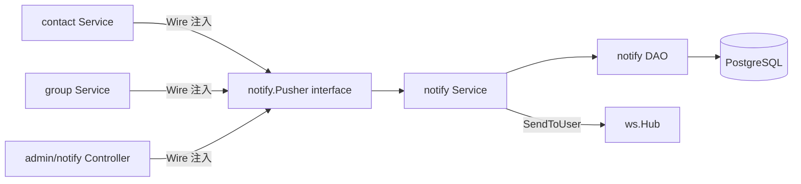

# Phase 2e-1 设计文档：统一通知中心

> **状态：** ✅ 已完成
> **上级设计：** [Phase 2e 整体路线图](./2026-04-20-phase2e-design.md)（本文档是其 §三「Phase 2e-1 详细设计」的专项展开版本，针对具体子阶段收敛）
> **实施计划：** [Phase 2e-1 实施计划](./2026-04-20-phase2e-1-implementation.plan.md)
> **验证报告：** [Phase 2e-1 测试验证报告](../../test-report-phase2e-1-notification.md)
> **分支：** `feature/phase2e-meeting-notification`
> **最后更新：** 2026-04-20（实施完成 + code-reviewer 审查修订）

---

## 一、文档定位说明

项目历史惯例：每个 Phase 子阶段对应一份 `{phase}-design.md`（设计）+ `{phase}-implementation.plan.md`（实施）文档。

**Phase 2e 采用「总-分」结构**：
- `2026-04-20-phase2e-design.md` —— Phase 2e 大阶段路线图 + 三个子阶段（2e-1/2e-2/2e-3）的总览与设计
- `2026-04-20-phase2e-1-design.md`（**本文档**） —— Phase 2e-1「统一通知中心」专用设计文档，汇聚该子阶段的所有设计决策与实施后修订
- `2026-04-20-phase2e-2-design.md` / `2026-04-20-phase2e-3-design.md` —— 待 2e-2/2e-3 启动时分别补充

选择这种结构的原因：三个子阶段共享部分设计背景（跨模块通信模式、mediasoup 与通知的关联等），保留总体设计可避免重复；但每个子阶段完成后应有独立的 design 落档，记录实施过程中的约束变化与修订。

---

## 二、目标与范围

### 2.1 业务目标

参照微信，为 EchoChat 补齐**「统一通知中心」**，解决现有系统三类问题：

1. **通知分散**：好友申请、入群邀请、系统公告等事件散落在各模块 toast，用户错过即丢失
2. **不可追溯**：无持久化，历史操作无法回查
3. **无统一入口**：用户无法集中查看所有待处理事项

### 2.2 交付范围（本期 P0）

| 能力 | 说明 | 对应 §phase2e-design |
|------|------|----------------------|
| 11 种通知 type 枚举 | 10 种本期落地 + 2 种预留（meeting_*） | [§3.2](./2026-04-20-phase2e-design.md#32-通知类型枚举11-种含-2e-22e-3-预留) |
| `notify_notifications` 表 | 新增 1 张 PostgreSQL 表 + 3 索引 + 30 天清理 | [§3.3](./2026-04-20-phase2e-design.md#33-数据库设计新增-1-张表) |
| 5 个 REST 接口 | 4 用户端 + 1 管理员广播 | [§3.4](./2026-04-20-phase2e-design.md#34-后端-rest-api设计文档更新) |
| 2 个 WS 事件 | `notify.new`（新通知） + `notify.unread.total`（断线补偿） | [§3.5](./2026-04-20-phase2e-design.md#35-websocket-事件2-个单端连接架构) |
| 跨模块 Pusher 接口 | contact/group → notify 的单向注入 | [§3.6](./2026-04-20-phase2e-design.md#36-跨模块-pusher-接口沿用-phase-2a-接口注入标准) |
| 通知中心前端 UI | profile 铃铛入口 + 5 分类 Tab 列表 + 内联操作 | [§3.8/3.9](./2026-04-20-phase2e-design.md#38-前端页面) |

### 2.3 显式不做（推迟清单）

| 能力 | 推迟原因 | 去向 |
|------|----------|------|
| 多端已读同步（`notify.read.ack`） | 现有 `ws.Hub` 单连接架构踢旧连接 | Phase 2f 或二期 |
| WS Hub 多端连接改造 | 技术债，需重构 `clients map[int64]*Client` | Phase 2f 或二期 |
| 管理端广播发布 UI | 后端接口已就绪，前端仅缺表单页 | Phase 2f |
| 通知分类开关（push 偏好） | MVP 默认全开 | Phase 2f |
| 会议类通知（meeting_invite/reminder）| 依赖 2e-2/2e-3 落地 | Phase 2e-2/2e-3 |
| Playwright E2E 自动化 CI | 当前仅手动验证清单 | CI 基础设施建设阶段 |

---

## 三、关键架构决策

### 3.1 单端 WS 连接架构（实施过程中锁定的核心约束）

**背景**：设计初期规划「多端已读同步」，实施时发现 `backend/go-service/pkg/ws/hub.go` 的 `clients map[int64]*Client` 实际只支持单连接 —— 同一用户新登录会主动关闭旧连接。

**决策**：
- **保持单端架构**，Phase 2e-1 不做 `ws.Hub` 改造
- **移除** `notify.read.ack` 事件（原计划跨设备广播已读）
- 通知系统设计为「当前活跃连接设备」单端体验，多端改造延后

**影响**：
- [设计文档 §3.1](./2026-04-20-phase2e-design.md#31-核心体验决策) 决策表「多端已读同步」项已改为「暂不支持」
- [§3.5](./2026-04-20-phase2e-design.md#35-websocket-事件2-个单端连接架构) WS 事件数从 3 个降为 2 个
- [§七](./2026-04-20-phase2e-design.md#七风险与应对) 对应的多端消息风暴风险天然规避
- [§九](./2026-04-20-phase2e-design.md#九后续规划清单必须留档) 推迟清单新增「WS Hub 多端连接支持改造」

### 3.2 跨模块通信模式（沿用 Phase 2a 接口注入标准）



**关键约束**：
- **依赖方向单向**：contact/group → notify，**反向禁止**（未来 2e-2 meeting 模块同样遵守）
- Pusher 接口定义在 `app/notify/service/pusher.go`，实现同包
- Wire 绑定：`wire.Bind(new(contactService.NotifyPusher), new(*notifyService.NotifyService))` 等
- **降级策略**：WS 推送失败不回滚数据库，下一次 `notify.unread.total` 补偿兜底

### 3.3 WS 连接建立/重连钩子

引入新接口 `ws.NotifyConnectHook`，在 `ws.Handler` 内连接建立成功后触发：

```go
type NotifyConnectHook interface {
    OnUserConnected(ctx context.Context, userID int64) error
}
```

由 `notify.NotifyService` 实现，推送 `notify.unread.total` 作为权威值覆盖前端本地缓存，**解决断线期间错过的通知数据一致性问题**。

### 3.4 30 天清理任务

- `app/notify/task/cleanup_task.go`：`time.Ticker` 驱动，默认 24 小时执行一次
- **策略**：只删除已读 + 过期（`is_read=true AND created_at < NOW() - 30 days`）
- 未读通知无论多久都保留，避免漏看历史重要事项
- 生命周期：随 `cmd/server/main.go` 启动，优雅关停

---

## 四、模块结构

### 4.1 后端（`backend/go-service/app/notify/`）

```
notify/
├── constants/
│   └── notify_types.go         # 11 种 type 常量 + 5 种 category 映射 + WS 事件名
├── model/
│   └── notification.go         # GORM 模型
├── dao/
│   └── notification_dao.go     # CRUD + 批量已读 + 统计 + 清理 + 全量用户列表
├── service/
│   ├── notify_service.go       # 业务逻辑（含 UserInfoResolver/NotifyConnectHook 实现）
│   └── pusher.go               # Pusher 接口 + Impl（持久化+WS 推送）
├── controller/
│   └── notification_controller.go  # 4 用户接口 + 1 管理员广播
├── task/
│   └── cleanup_task.go         # 30 天清理 cron
├── provider.go                 # Wire NotifySet
└── router.go                   # 路由注册
```

### 4.2 前端（`frontend/src/`）

```
frontend/src/
├── api/notify.js                       # REST API 封装
├── constants/notify.js                 # 前端常量（type/category/图标/颜色/支持内联操作判定）
├── store/notify.js                     # Pinia Store（分类缓存 + cursor 分页 + WS 监听）
├── components/notify/
│   └── NotifyItem.vue                  # 通用卡片（按 type 渲染 + 内联"接受/拒绝"按钮）
└── pages/notify/
    └── index.vue                       # 通知中心主页（5 分类 Tab + 骨架/空态/列表）
```

---

## 五、验收标准

- [x] 10 种业务通知类型全部正确触发并落库（friend×3 + group×6 + system×1）
- [x] 用户 A 给 B 发好友申请 → B 通知中心出现记录，WS 实时收到 `notify.new`，铃铛徽标 +1
- [x] 群邀请/入群申请支持内联「接受/拒绝」按钮
- [x] 管理员 `POST /api/v1/admin/notifications/broadcast` 推送 `system_broadcast` → 在线用户实时收到
- [x] 断线重连 → 收到 `notify.unread.total`，徽标与后端查询一致
- [x] 30 天前已读通知被清理；未读无论多久都保留
- [x] Logout → `notifyStore.reset()` 清空，防止跨用户数据泄漏
- [x] `frontend/src/store/contact.js:155` 旧散落监听已删除，无重复提示
- [x] `frontend/src/store/group.js` `_onJoinRequest`/`_onJoinApproved` 的 `uni.showToast` 已移除
- [x] 代码审查（`code-reviewer` 子代理）通过，Blocker 全部修复

---

## 六、实施后的修订记录

### 6.1 设计变更（相对原设计的偏离）

| 项 | 原计划 | 实际落地 | 原因 |
|----|--------|----------|------|
| WS 事件数量 | 3 个（含 `notify.read.ack`） | **2 个** | 单端 WS 架构约束 |
| 多端已读同步 | 后端主导 WS 广播 | **不支持** | 同上，推迟到 Phase 2f |
| Playwright E2E 自动化 | 每项核心场景都有脚本 | 改为 `test-report-*.md` 手动验证清单 | 缺少 E2E CI 基础设施 |

### 6.2 Code-Reviewer 审查发现（2026-04-20）

整体结论：**有条件通过**（1 Blocker / 5 Major / 11 Minor / 10 亮点）

**🔴 Blocker（已当场修复）**：
- `markAllRead` 前后端契约错位：前端将 `category` 放入 PUT body，后端读 query string → 分类标记已读失效
- **修复**：`frontend/src/api/notify.js` 改为 `PUT /api/v1/notifications/read-all?category=xxx`；同步 [Notify API 文档 §4](../api/frontend/notify.md#4-批量标记已读) 明确 Query 契约
- **验证**：后端 `go build ./...` 通过；纳入 Playwright 验证清单复测项

**🟡 Major / 🟢 Minor 项**：均不阻塞合入，已纳入 [Phase 2e 设计文档 §九](./2026-04-20-phase2e-design.md#九后续规划清单必须留档) Phase 2f 清理清单，包括：
- Response 字段与文档一致性细化
- 前端常量重复定义合并
- WS `notify.new` / `notify.unread.total` 事件竞态兜底
- NotifyItem 防重点击
- Broadcast 错误语义增强
- DDL 字段尺寸微调 / Pusher 签名与设计稿对齐 / WS 幂等去重 / goroutine 限流等

### 6.3 Playwright MCP 端到端验证（2026-04-20）

> 详细见 [测试验证报告 §八](../../test-report-phase2e-1-notification.md#八playwright-mcp-自动化验证与-bug-修复2026-04-20)

通过 Playwright MCP 驱动 H5 浏览器对 testuser1（id=4）完整走查：登录 → 进入通知中心 → 构造好友申请 → 管理员广播 → 点击标记已读 → Deep-link 跳转 → 全部已读，**所有链路通过**。

**现场发现并修复 2 个 Bug**：

| 级别 | Bug | 根因 | 修复 |
|------|-----|------|------|
| 🔴 Bug-1 | 点击通知 `PUT .../undefined/read` 400 | `NotifyItem` 自定义 emit 名 `tap` 与 uni-app 原生 DOM 事件冲突，Event 对象覆盖 notify 参数 | emit 名改为 `item-tap` / `item-accept` / `item-reject`，父组件同步更新 |
| 🟡 Bug-2 | 标记已读后分类角标不递减，依赖下次 fetch 修复 | `markRead` 调用 `_patchAll` 后 `target.is_read` 已变 true，`if (!target.is_read)` 永假 | 预先快照 `const wasUnread = !!target && !target.is_read` |

**涉及文件**：
- `frontend/src/components/notify/NotifyItem.vue`
- `frontend/src/pages/notify/index.vue`
- `frontend/src/store/notify.js`

**验证结论**：WS 实时推送（admin 广播 → 1s 内前端自动插入列表 + 角标 +1）、Deep-link 跳转（好友申请 → `/pages/contact/request`）、批量清零（「全部已读」按钮）、分类 Tab 独立统计等全部正常。前后端 `go build ./...` 与前端 lint 均通过。

### 6.4 TabBar「我的」聚合未读红点（2026-04-21）

#### 背景

实施完成后反馈：通知中心的未读数仅在 `/pages/profile/index` 页面内（铃铛 badge、菜单项 badge）可见；用户在其他 tabBar 页面（消息/联系人/会议）时无法感知「我的」模块有新事件，需被动切到"我的"才知道。这违反了"一级导航应承担未读提醒职责"的基本原则。

#### 设计决策

采用业界主流做法（微信/QQ/钉钉的"我"Tab 模式）：**tabBar「我的」图标右上角显示纯红点（无数字），作为"我的"模块所有未读事件的聚合指示器**。

设计原则：

1. **信息层级分离**：tabBar 是一级导航，只需 Boolean（有/无未读）；具体数字属于二级信息，进入页面后再展示
2. **聚合指示器可扩展**：红点来源是一个**开放集合**，当前只聚合 `notifyStore.unreadTotal`，未来可无缝追加「资料待完善」「安全提醒」「新版本可用」等，tabBar 无需感知具体来源
3. **语义清晰不混用**：保留现有 `getBadge(index)`（返回数字，用于消息/联系人 Tab）；新增 `hasDot(index)`（返回布尔，用于"我的" Tab）；模板优先渲染数字 badge，无数字时再渲染红点

#### 实现摘要

| 层 | 改动 |
|---|---|
| `frontend/src/components/CustomTabBar.vue` | 引入 `useNotifyStore`，新增 `hasDot(index)` 方法；模板条件渲染 `.tab-dot` 元素；补充小红点样式（16rpx 红色圆点 + 2rpx 白色描边） |

核心代码（聚合逻辑集中在 `hasDot(3)`，未来扩展仅需追加 `|| 新来源`）：

```javascript
hasDot(index) {
  if (index === 3) {
    const notifyStore = useNotifyStore()
    return notifyStore.unreadTotal > 0
    // 未来扩展示例：
    //   || profileStore.hasProfileReminder
    //   || securityStore.hasSecurityAlert
    //   || appStore.hasNewVersion
  }
  return false
}
```

#### 验证（Playwright）

| 场景 | tabBar "我的" | 结果 |
|---|---|---|
| 有 3 条未读 · 消息页 | 红点亮 | ✅ |
| 有 3 条未读 · 我的页（选中态） | 红点亮 | ✅ |
| 点"全部已读"后 · 我的页 | 红点消失 | ✅ |
| 返回消息页 | 红点消失 | ✅ |

三层信息层级同步响应 `unreadTotal` 变化：tabBar 红点（Boolean） / 铃铛 badge（数字 3） / 通知中心菜单 badge（数字 3）。

---

## 七、关联文档

- [Phase 2e 整体路线图](./2026-04-20-phase2e-design.md)（本文档的上级设计）
- [Phase 2e-1 实施计划](./2026-04-20-phase2e-1-implementation.plan.md)（11 个 Task 拆分）
- [Phase 2e-1 测试验证报告](../../test-report-phase2e-1-notification.md)（E2E 清单 + 审查修复记录）
- [Notify API 文档](../api/frontend/notify.md)（5 REST + 2 WS 事件）
- [项目开发进度 · CURRENT_STATUS](../progress/CURRENT_STATUS.md)
- [项目上下文 · project-context.mdc](../../.cursor/rules/project-context.mdc)

---

## 八、变更记录

| 日期 | 变更 |
|------|------|
| 2026-04-20 | Phase 2e-1 设计文档首版落盘（由 Phase 2e 总设计 §三 专项展开 + 实施后修订合并） |
| 2026-04-20 | 锁定单端 WS 架构决策，移除 `notify.read.ack`；code-reviewer Blocker 修复记录 |
| 2026-04-20 | 追加 §6.3 Playwright MCP 端到端验证成果，记录 2 个现场发现的交互 Bug 修复（事件名冲突、markRead 竞态） |
| 2026-04-21 | 追加 §6.4 TabBar「我的」聚合未读红点设计与实现，解决跨 tabBar 页面的未读感知问题（为后续我的模块功能扩展预留聚合入口） |
