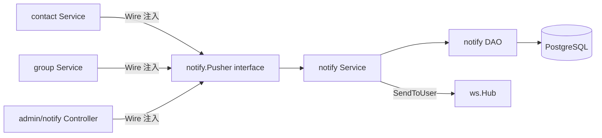
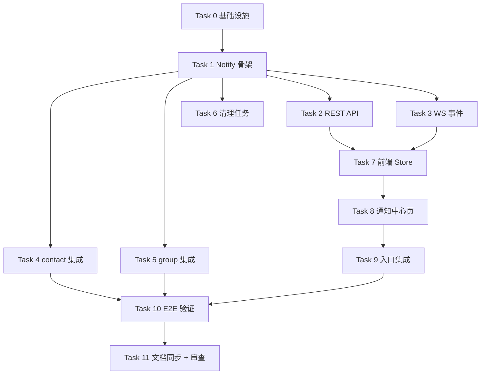

# Phase 2e-1 实施计划：统一通知中心

> **状态：** ✅ 已完成
> **设计文档：** [Phase 2e 设计文档](./2026-04-20-phase2e-design.md)
> **验证报告：** [Phase 2e-1 测试验证报告](../../test-report-phase2e-1-notification.md)
> **分支：** `feature/phase2e-meeting-notification`
> **原规划文件（Cursor 临时）：** `.cursor/plans/phase_2e-1_通知系统实施_b2d43c9d.plan.md`（已被 `.gitignore`，本文档为其正式归档版本）
> **最后更新：** 2026-04-20（Task 11 落盘同步）

---

## 一、范围锁定

### 包含

- **10 种业务通知类型**（本期落地触发）：
  - `friend_request` / `friend_accepted` / `friend_rejected`
  - `group_invite` / `group_join_request` / `group_join_approved` / `group_join_rejected` / `group_kicked` / `group_role_changed`
  - `system_broadcast`
- **2 种仅预留枚举**（业务由 2e-2/2e-3 对接）：`meeting_invite`、`meeting_reminder`
- 单端 WS 连接架构（沿用现状）：**不做多端已读同步**
- 双通道推送：持久化入库 + WS `notify.new` 实时推送 + 铃铛徽标 + mini-toast
- 通知中心 UI：顶部 5 分类 Tab（全部/好友/群聊/会议/系统）+ 下拉刷新 + 上拉加载
- 管理员广播：`POST /api/v1/admin/notifications/broadcast`（仅后端，前端 UI 推迟）

### 显式推迟（详见设计文档 §九）

- **WS Hub 多端连接支持改造** → Phase 2f / 二期
- `notify.read.ack` 跨设备广播 → 依赖上项，同步推迟
- 管理端广播发布 UI → Phase 2f
- 通知分类开关（push 偏好设置）→ Phase 2f
- Playwright 自动化 CI → 待 CI 基础设施建设统一接入

---

## 二、关键架构决策

### 2.1 跨模块通信模式（沿用 Phase 2a 接口注入标准）

- `notify.Pusher` 接口定义在 `app/notify/service/pusher.go`，实现同包
- contact/group 通过 Wire 绑定 `NotifyPusher` 字段（interface 类型）
- **单向依赖**：contact/group → notify，**反向禁止**（Phase 2e-2 meeting 模块同样遵守）
- **降级策略**：WS 推送失败不回滚入库，下一次 `notify.unread.total` 补偿兜底

### 2.2 单端 WS 推送（2 个事件）

| 事件 | 方向 | 触发时机 | Payload |
|------|------|----------|---------|
| `notify.new` | S→C | Pusher 入库成功后立即推送 | 完整通知对象 |
| `notify.unread.total` | S→C | 连接建立/重连后钩子触发 | `{ total, by_category }` 权威值 |

**不引入** `notify.read.ack`（WS Hub 单连接架构已天然规避多端同步风暴）。

### 2.3 数据库（新增 1 张表）

`notify_notifications` 表：`id / user_id / type / title / content / extra(JSONB) / actor_id / target_type / target_id / is_read / read_at / created_at`

索引：`(user_id, is_read, created_at DESC)`、`(user_id, type, created_at DESC)`、`created_at`（配合 30 天清理）。

---

## 三、文件与变更清单

### 3.1 后端新增（`backend/go-service/`）

| 文件 | 作用 |
|------|------|
| `app/notify/constants/notify_types.go` | 11 种 type 常量 + 5 种 category 映射 + WS 事件名 |
| `app/notify/model/notification.go` | GORM 模型 |
| `app/notify/dao/notification_dao.go` | CRUD + 批量已读 + 未读统计 + 清理 + 全量用户列表 |
| `app/notify/service/notify_service.go` | 业务逻辑（创建/列表/标已读/广播） |
| `app/notify/service/pusher.go` | `Pusher` 接口 + Impl（持久化 + WS 推送） |
| `app/notify/controller/notification_controller.go` | 4 用户接口 + 1 管理员广播接口 |
| `app/notify/router.go` | 路由注册 |
| `app/notify/provider.go` | Wire `NotifySet` |
| `app/notify/task/cleanup_task.go` | 30 天清理 cron（默认每日） |
| `app/constants/notify.go` | 跨模块共享常量（type / category / WS event） |
| `app/dto/notify_dto.go` | 请求 / 响应 / 广播 DTO |

### 3.2 后端改造

| 文件 | 改动 |
|------|------|
| `app/provider/provider.go` | `App` 结构体新增 `NotificationController` / `NotifyCleanupTask` / `NotifyPusher`；`NewApp` 签名扩展 |
| `app/provider/wire.go` | 注册 `NotifySet`；绑定 `contactService.NotifyPusher` / `groupService.NotifyPusher` / `notifyService.UserInfoResolver` / `ws.NotifyConnectHook` |
| `app/provider/wire_gen.go` | 同步 Wire 生成产物 |
| `app/contact/service/contact_service.go` | **3 处** Pusher.Push：SendFriendRequest / AcceptFriendRequest / RejectFriendRequest |
| `app/group/service/group_service.go` | **6 处** Pusher.Push：InviteMembers / RequestJoin / ApproveJoin / RejectJoin / KickMember / ChangeRole |
| `app/ws/handler.go` | 连接建立/重连时触发 `NotifyConnectHook.OnUserConnected` → 推送 `notify.unread.total` |
| `cmd/server/main.go` | 启动 `app.NotifyCleanupTask.Start()` + `defer Stop()` |
| `router/router.go` | `notifyApp.RegisterRoutes(engine, app.NotifyController, jwtAuth)` |
| `deploy/docker/postgres/init.sql` | 追加 `notify_notifications` DDL + 3 个索引 |

### 3.3 前端新增（`frontend/src/`）

| 文件 | 作用 |
|------|------|
| `api/notify.js` | REST API 封装（getNotifications / getUnreadCount / markRead / markAllRead） |
| `constants/notify.js` | 前端常量（与后端 type/category 对齐 + 图标/颜色/支持内联操作判定） |
| `store/notify.js` | Pinia Store（分类缓存 + cursor 分页 + WS 监听 + reset） |
| `components/notify/NotifyItem.vue` | 通用卡片（按 type 渲染 + 内联"接受/拒绝"按钮） |
| `pages/notify/index.vue` | 通知中心页（5 分类 Tab + 骨架/空态/列表） |

### 3.4 前端改造

| 文件 | 改动 |
|------|------|
| `pages.json` | 注册 `pages/notify/index`（custom navigationStyle） |
| `App.vue` | 全局 WS 初始化时调用 `useNotifyStore().initWsListeners() + fetchUnreadCount()` |
| `pages/auth/login.vue` | 登录成功后同上初始化 |
| `pages/profile/index.vue` | 顶部铃铛图标 + 徽标 + 「通知中心」菜单项 + `onShow` 刷新未读 |
| `store/user.js` | `logout()` 内调用 `notifyStore.reset()`，防止跨用户数据泄漏 |
| `store/contact.js` | 删除原 `notify.friend.request` 散落监听（由 notify store 接管） |
| `store/group.js` | 清理 `_onJoinRequest` / `_onJoinApproved` 中的 `uni.showToast`（统一到 notify store） |

### 3.5 文档

| 文件 | 操作 |
|------|------|
| `docs/plans/2026-04-20-phase2e-design.md` | §3.1/§3.5/§八/§九 修订「单端 WS 架构」约束 |
| `docs/plans/2026-04-20-phase2e-1-implementation.plan.md` | **本文档**（正式版归档） |
| `docs/api/frontend/notify.md` | 新增 notify API 文档（5 REST + 2 WS 事件） |
| `docs/api/README.md` | 导航更新 |
| `docs/progress/CURRENT_STATUS.md` | 进度同步 |
| `.cursor/rules/project-context.mdc` | 跨模块通信模式 + 推迟清单更新 |
| `test-report-phase2e-1-notification.md` | E2E 验证报告 + Task 11 审查修复记录 |

---

## 四、Task 拆分（11 个 Task，按依赖分层）

| # | Task | 依赖 | 交付产物 |
|---|------|------|----------|
| **Task 0** | 基础设施：DDL + constants + DTO + model | — | 数据库表、常量、DTO、GORM 模型 |
| **Task 1** | Notify 模块骨架：DAO + Service + Pusher 接口 + Wire | T0 | 完整模块雏形，可独立编译 |
| **Task 2** | REST API：4 用户接口 + 1 管理员广播 | T1 | `/api/v1/notifications/*` + `/api/v1/admin/notifications/broadcast` |
| **Task 3** | WS 事件：`notify.new` + `notify.unread.total` 断线补偿 | T1 | Pusher 内部推送 + `ws.Handler` 钩子 |
| **Task 4** | contact 模块 Pusher 集成（3 类好友事件） | T1 | 申请/接受/拒绝 → 3 处 Push |
| **Task 5** | group 模块 Pusher 集成（6 类群聊事件） | T1 | 邀请/申请/批准/拒绝/踢人/角色变更 → 6 处 Push |
| **Task 6** | 30 天清理定时任务 | T1 | `CleanupTask` + 启动/停止集成 |
| **Task 7** | 前端 Pinia Store + API 封装 + WS 监听 | T2+T3 | `store/notify.js` + `api/notify.js` + 2 事件监听 |
| **Task 8** | 通知中心页 + NotifyItem 组件 + 5 分类 Tab | T7 | `pages/notify/index.vue` + 组件 |
| **Task 9** | profile 入口集成 + 冗余代码清理 | T8 | 铃铛徽标 + `contact.js:155` / `group.js:292` 清理 |
| **Task 10** | 端到端验证（4 类场景 + 视觉回归） | T4+T5+T9 | `test-report-phase2e-1-notification.md` |
| **Task 11** | 设计文档修订 + `code-reviewer` 审查 + 所有文档同步 | T10 | 设计文档 §3.1/§3.5/§八/§九 修订 + 审查报告 |

### 依赖关系图

---

## 五、端到端验收标准

- [x] 用户 A 给 B 发好友申请 → B「我的」铃铛徽标 +1，通知中心出现记录，WS 实时收到 `notify.new`
- [x] B 点击通知 → 跳转好友申请页；处理后通知自动标已读 → 徽标 -1
- [x] 张三邀请李四入群 → 李四收到卡片内联「接受/拒绝」，操作后群状态与通知状态一致
- [x] 管理员 `POST /api/v1/admin/notifications/broadcast` → 所有在线用户实时收到 `system_broadcast`
- [x] 断线重连：前端收到 `notify.unread.total`，徽标与后端 API 查询一致
- [x] 30 天前已读通知被清理任务删除；未读通知无论多久都不被清理
- [x] `frontend/src/store/contact.js:155` 旧处理已删除，无重复提示
- [x] Logout → `notifyStore.reset()` 清空，防止跨用户数据泄漏
- [x] ~~多端已读同步~~ → **架构限制不支持**，设计文档已修订

---

## 六、风险与应对

| 风险 | 等级 | 应对 | 实际结果 |
|------|------|------|----------|
| Pusher 同步调用阻塞业务 | 中 | WS 推送失败仅 warn 日志，不阻塞业务主流程 | ✅ 已落实 |
| contact/group 现有业务逻辑受影响 | 中 | 每个调用点保留原路径，Pusher 仅旁路调用 | ✅ 无回归 |
| Wire 生成器循环依赖 | 高 | 严格单向 contact/group → notify，interface 注入 | ✅ 无循环 |
| 前端 toast 与现有 `uni.showToast` 冲突 | 中 | 统一由 notify store 触发，其他模块不再直接调用 | ✅ 已清理 `contact.js:155` / `group.js:292` |
| 管理端广播权限 | 高 | `middleware.RequireRole(admin/super_admin)` | ✅ 已校验 |
| 代码审查漏网 | 中 | Task 11 调用 `code-reviewer` 子代理 | ✅ 发现 1 Blocker 已修复 |

---

## 七、实施后的连带动作

1. ✅ 修订 `docs/plans/2026-04-20-phase2e-design.md`：
    - §3.1 决策表「多端已读同步」改为「暂不支持（WS Hub 单端架构）」
    - §3.5 WS 事件表移除 `notify.read.ack`
    - §八验收标准全部标记完成并注明限制
    - §九推迟清单新增「WS Hub 多端连接支持改造」+「Playwright E2E CI」
    - §十新增 2026-04-20 实施完成变更记录
2. ✅ `code-reviewer` 子代理审查（结论：有条件通过）
    - 🔴 Blocker：`markAllRead` 前端 body / 后端 query 契约错位 → 已修复（`frontend/src/api/notify.js` 改走 Query）
    - 🟡 Major × 5 / 🟢 Minor × 11：不阻塞合入，纳入 Phase 2f 清理清单
3. ✅ 所有规划 + 实施 + 验证文档在同一分支（`feature/phase2e-meeting-notification`）提交
4. ✅ `feature/phase2e-meeting-notification` 分支准备就绪，下一步可 PR 合并至主干或继续 Phase 2e-2

---

## 八、工期回顾

| 子任务 | 预估 | 实际 | 备注 |
|--------|------|------|------|
| 后端（Task 0-6） | 2 人日 | ~2 人日 | Wire 绑定与 ws.Handler 钩子略超预期 |
| 前端（Task 7-9） | 1.5 人日 | ~1.5 人日 | 分类缓存 + WS 去重实现顺利 |
| E2E + 审查 + 文档（Task 10-11） | 0.5 人日 | ~1 人日 | 代码审查发现 Blocker 增加修复耗时 |
| **合计** | **4 人日** | **~4.5 人日** | 与设计文档预估基本一致 |

---

## 九、关联文档

- [Phase 2e 总体设计](./2026-04-20-phase2e-design.md)
- [Phase 2e-1 测试验证报告](../../test-report-phase2e-1-notification.md)
- [Notify API 文档](../api/frontend/notify.md)
- [项目开发进度 · CURRENT_STATUS](../progress/CURRENT_STATUS.md)
- [项目上下文 · project-context.mdc](../../.cursor/rules/project-context.mdc)
