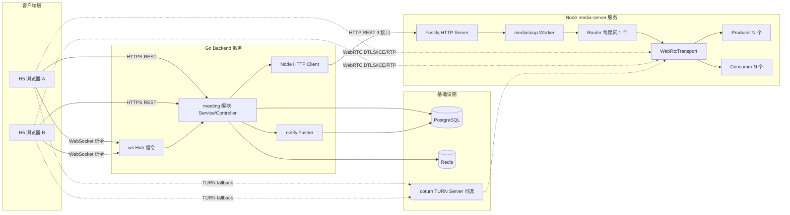
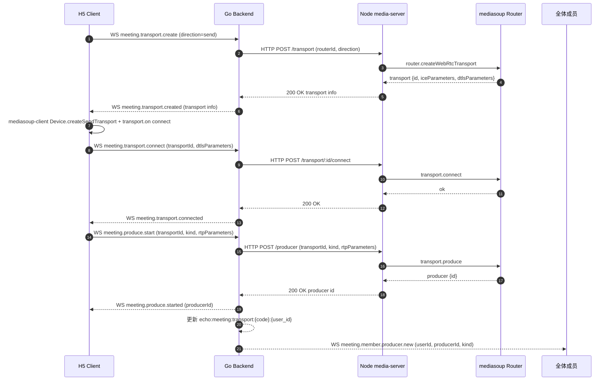
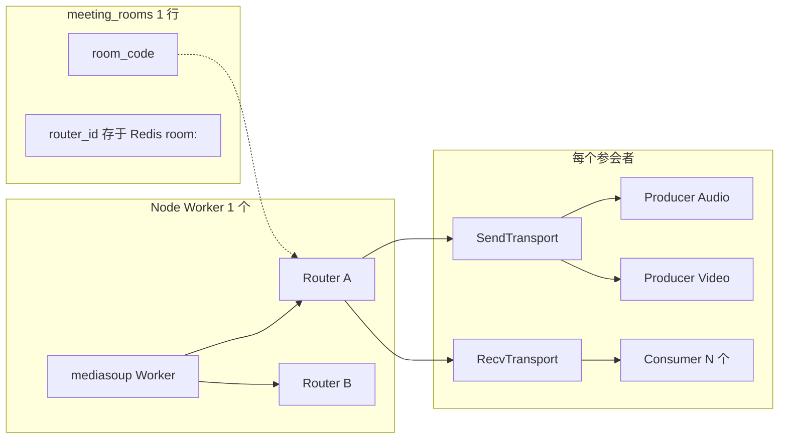
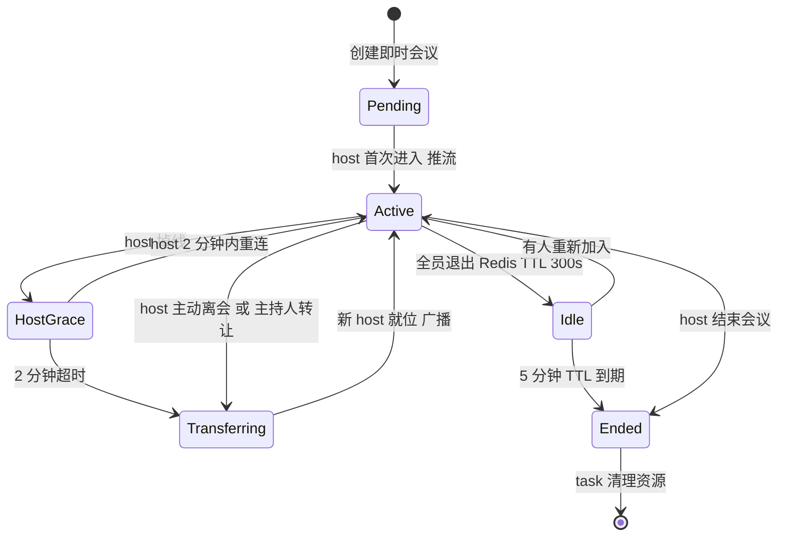

# Phase 2e-2 设计文档：会议 MVP（多人音视频）

> **状态：** 📋 设计阶段（待评审后进入代码开发）
> **上级设计：** [Phase 2e 整体路线图](./2026-04-20-phase2e-design.md)（本文档是其 §四「Phase 2e-2 会议 MVP」的专项展开版本，对齐 Phase 2e-1 的「总-分」设计文档结构）
> **实施计划：** [Phase 2e-2 实施计划](./2026-04-21-phase2e-2-implementation.plan.md)
> **前置依赖：** Phase 2a（联系人 + WS）、Phase 2b（即时通讯）、Phase 2c（群聊 + 已读）、Phase 2d（消息类型扩展）、Phase 2e-1（统一通知中心）均已完成
> **分支：** `feature/phase2e-2-meeting-mvp`
> **最后更新：** 2026-04-21（设计文档首版落盘，待评审）

---

## 一、文档定位说明

项目惯例：每个 Phase 子阶段对应一份 `{phase}-design.md`（设计）+ `{phase}-implementation.plan.md`（实施），双文档绑定协同。

**Phase 2e 三子阶段文档结构**：

- [`2026-04-20-phase2e-design.md`](./2026-04-20-phase2e-design.md) — Phase 2e 大阶段路线图 + 三子阶段（2e-1 / 2e-2 / 2e-3）的总览与衔接
- [`2026-04-20-phase2e-1-design.md`](./2026-04-20-phase2e-1-design.md) — Phase 2e-1 「统一通知中心」专用设计（✅ 已完成）
- [`2026-04-21-phase2e-2-design.md`](./2026-04-21-phase2e-2-design.md)（**本文档**） — Phase 2e-2 「会议 MVP」专用设计（📋 设计阶段）
- `2026-04-21-phase2e-3-design.md` — 待 2e-3 启动时补充（预约会议 / 提醒 / 等候室 / 会议预览高级参数）

采用总-分结构的理由：三子阶段共享部分设计背景（跨模块通信、接口注入模式、通知类型枚举），保留总设计可避免重复；但每个子阶段需独立落档以承载具体的架构决策、状态机、数据模型与实施约束。

与 Phase 2e-1 不同的是：Phase 2e-2 引入了**全新技术栈**（Node.js + mediasoup + WebRTC）与**全新子项目目录**（`media-server/`），因此本文档对架构与风险描述比 Phase 2e-1 更详尽。

---

## 二、目标与范围

### 2.1 业务目标

在 Phase 2a-2e-1 建立的 IM 基础能力之上，**交付一个可独立运行、可对外演示、可被 Phase 2e-3 增强的多人音视频会议 MVP**，支持：

1. **即时会议**：用户一键创建会议 → 分享会议号/邀请链接/通知邀请 → 其他用户加入 → 完成音视频通话 → 结束
2. **端到端音视频**：基于 mediasoup SFU 架构，支持 ≤8 人同时音视频（1 路音频 + 1 路视频 per user）
3. **基础主持人控制**：静音他人 / 移除成员 / 转让主持人 / 结束会议
4. **与通知中心的闭环**：会议中的「邀请」操作通过 Phase 2e-1 的 `notify.Pusher` 触发 `meeting_invite` 通知卡片
5. **双态部署**：本机 Docker Compose 即装即用 + 公网 announcedIp/TURN 配置预留（上线前补 TURN 即可公网跑通）

### 2.2 MVP 硬边界

#### 2.2.1 本期交付（✅）

| 能力分类 | 项 | 说明 |
|---|---|---|
| 会议创建 | 即时会议（type=1） | 用户点击「立即开会」→ 自动生成会议号 → 进入会议室 |
| 会议加入 | 会议号手输 | 输入 `XXX-XXX-XXX` + 可选密码 |
| 会议加入 | 邀请链接 | `http(s)://{host}/#/meeting/join?code=XXX-XXX-XXX` 一键入会（含密码则弹密码框） |
| 会议加入 | 通知中心邀请 | 触发 `meeting_invite` 通知卡片，内联「立即加入 / 稍后」按钮 |
| 容量限制 | ≤ 8 人 | 超过返回错误码，不放行 |
| 音视频 | 麦克风开关 | mediasoup Producer audio 启停 |
| 音视频 | 摄像头开关 | mediasoup Producer video 启停 |
| 音视频 | 入会前设备预览 | 独立预览页：设备选择 + 本地画面 + 音量检测 + 降噪开关（可选） |
| 主持人权限 | 静音他人 | 通过 WS 指令通知对方静音，最终由客户端 Producer.pause 执行 |
| 主持人权限 | 移除成员 | 强制目标离会，关闭其 Transport 与 Producer |
| 主持人权限 | 转让主持人 | 主持人显式选择某成员为新 host |
| 主持人权限 | 结束会议 | 关闭 router + 广播 meeting.ended 事件 |
| 生命周期 | 主持人离开自动转让 | 转让给「剩余成员中最早加入者」 |
| 生命周期 | 全员退出 TTL | 5 分钟后自动销毁房间与 mediasoup router |
| 会议内聊天 | 文字聊天 | 独立 `meeting_chats` 表，会议结束自动清理（TTL 24h 或 endedAt 后批量删） |
| 前端适配 | 桌面浏览器 | ≥ 1024px，最大 3x3 视频网格 |
| 前端适配 | 手机浏览器 | < 768px 单列或 2 列，底部安全区适配 |
| 管理端 | **本期不做** | 管理端会议列表/详情/强制关闭推迟到 Phase 2f |
| 部署 | 双态配置 | `MEDIASOUP_ANNOUNCED_IP` 与 `TURN_ENABLED` 环境变量切换本机/公网 |

#### 2.2.2 本期不做（❌，明确推迟）

| 项 | 推迟去向 |
|---|---|
| 预约会议（type=2） + 定时触发 | Phase 2e-3 |
| 会议提醒（`meeting_reminder`） | Phase 2e-3 |
| 等候室（waiting room） | Phase 2e-3 |
| 锁定会议（lock） | Phase 2e-3 |
| 屏幕共享（screen share） | 第二期 |
| 会议录制与回放 | 第二期 |
| 虚拟背景 / 背景模糊 | 第二期 |
| 联合主持人（role=2） | 第二期（表中 role 字段预留枚举值） |
| 管理端会议列表 / 详情 / 强制结束 | Phase 2f |
| 管理端会议统计仪表板 | Phase 2f |
| 多 Worker / 多 Router 集群 | 第三期 |
| 跨服务器会议（Router Pipe） | 第三期 |

---

## 三、关键决策记录（11 项，D01-D11）

> 本节是 MVP 架构与工作量估算的**唯一真理来源**。后续任何偏离这些决策的修订都必须先在此处更新并记入 §十六 变更记录。

### D01 部署形态：双态可切

- **决策**：本机 Demo + 公网就绪两种形态通过**环境变量**切换，不做代码分支
- **理由**：用户明确"本机和公网都要能部署成功和使用"。一套代码 + 配置分离符合 12-factor 原则
- **关键环境变量**：
  - `MEDIASOUP_LISTEN_IP`：mediasoup RTCTransport 监听 IP（本机 `0.0.0.0`，公网 `0.0.0.0`）
  - `MEDIASOUP_ANNOUNCED_IP`：对端通告 IP（本机留空/`127.0.0.1`，公网填服务器公网 IP 或域名解析 A 记录）
  - `MEDIASOUP_RTC_MIN_PORT` / `MEDIASOUP_RTC_MAX_PORT`：RTP UDP 端口范围（默认 `40000-49999`，Docker 需 host 网络或显式端口映射）
  - `TURN_ENABLED`：是否启用 TURN fallback（公网建议 `true`）
  - `TURN_URLS` / `TURN_USERNAME` / `TURN_CREDENTIAL`：TURN 服务器连接参数
- **docker-compose 策略**：coturn 服务声明 `profiles: [public]`，默认不启动；运行 `docker compose --profile public up` 才拉起 TURN

### D02 前端端形：仅 H5

- **决策**：MVP 仅支持 H5 浏览器端（Chrome / Edge / Safari / 移动浏览器），不支持微信小程序、不支持原生 App
- **理由**：mediasoup-client 依赖标准 WebRTC API，uni-app 小程序环境不可用（仅 live-pusher/live-player 私有协议）；frontend/uni-app 当前主要构建目标就是 H5
- **浏览器要求**：支持 WebRTC 1.0（`RTCPeerConnection`、`getUserMedia`）；设备预览页对不支持的浏览器显示降级提示

### D03 Go-Node 协同：Go 主控 + Node 无状态包装

- **决策**：Go backend 承载所有权威状态（房间、成员、权限、鉴权），Node media-server 仅作为 mediasoup API 的 HTTP 封装层，自身不维护业务状态
- **理由**：权威状态集中 + 鉴权统一 + 管理端后续扩展（强制关闭 / 踢人审计）易于在 Go 侧实现，Node 可按需扩容或替换
- **通信形式**：
  - 客户端 ↔ Go：WebSocket（信令） + HTTPS（REST CRUD）
  - Go ↔ Node：**仅 HTTP REST**（9 个接口，容器内网 `http://media-server:3300`）
  - 客户端 ↔ Node：**仅 WebRTC**（RTP 媒体流，通过 mediasoup DTLS/ICE 握手直连）
- **异常传播**：Node 返回非 2xx 或超时 → Go 映射为业务错误码 → 经 WS 通知客户端

### D04 设备预览：MVP 纳入

- **决策**：创建/加入会议后先进「设备预览页」，完成设备选择、本地预览、音量检测后才进会议室推流
- **理由**：首次使用者需要明确的权限授权与设备选择窗口，不纳入会导致"打开会议 = 强制推流"的不良体验
- **预览页核心能力**：摄像头 / 麦克风 / 扬声器设备选择（`enumerateDevices`）、本地视频预览（`getUserMedia` localStream）、麦克风音量条（AudioContext AnalyserNode）、显示名称输入/昵称确认、「加入会议」按钮

### D05 加入体验套餐 C：会议号 + 密码 + 链接 + 通知闭环

- **决策**：MVP 同时支持三种加入方式，并打通与 Phase 2e-1 通知中心的 `meeting_invite` 类型
- **会议号格式**：9 位数字，分组展示 `XXX-XXX-XXX`，数据库存 `VARCHAR(20)`（允许后续扩展），唯一约束
- **密码**：可选，bcrypt 哈希存储（**修订**总设计 `password VARCHAR(50)` 明文为 `password_hash VARCHAR(255)`），密码对手输/链接/通知三种入口同等生效
- **邀请链接**：`{WEB_BASE_URL}/#/meeting/join?code={room_code}`（若有密码，加入时弹密码框）
- **通知邀请**：会议内「邀请联系人 / 群成员」→ 调用 `notify.Pusher.Push(ctx, receiverID, PushRequest{Type: "meeting_invite", ...})`，通知卡片内联「立即加入 / 稍后」

### D06 会议生命周期策略 A：主持人转让 + 空房 5 分 TTL

- **决策**：
  - **主持人主动离会**：系统自动从剩余成员中挑「最早加入（joined_at 最小）」的人升为 host，广播 `meeting.host.changed`
  - **主持人掉线**：首次掉线**保留 host 身份 + 2 分钟宽限期**（可重连），宽限期内其他人不自动升 host；宽限期结束仍未重连，执行自动转让
  - **全员退出**：Redis `echo:meeting:room:{code}` TTL 设为 300 秒，5 分钟内有人重入则房间复用；过期后由定时任务销毁 mediasoup router 并将 `meeting_rooms.status` 置 2（已结束）
- **理由**：兼顾微信 / 腾讯会议的容错习惯，对断网重连友好

### D07 UI 风格：飞书简洁框架 + EchoChat 原创

- **决策**：整体视觉密度、导航层级参考飞书会议（干净、留白充分、功能入口前置）；但**不照抄**，由 `ui-ux-pro-max` 技能包为 EchoChat 产出原创视觉语言
- **EchoChat 创新特色候选**（在 §九 展开）：
  - 说话者画面外轮廓流光动效（替代主流的绿色静态外框）
  - 柔性网格布局：2 人/3 人/4 人时采用非均分自适应布局（非强制 2x2 / 3x3）
  - 自视频手势拖拽 + 多锚点吸附（四角 / 中央）
  - 静音氛围色：底部工具栏在全员静音时呈现冷色调氛围提示
- **落地**：设计产物存 `design-system/echochat/pages/meeting-*.md`，不在代码中硬编码样式

### D08 主持人权限范围 A：四件套

- **决策**：静音他人 / 移除成员 / 转让主持人 / 结束会议
- **不做**：静音全员 / 锁定会议 / 等候室 / 邮件邀请 / 开麦申请
- **理由**：MVP 用户少（≤8），不需要全员管控；其余功能推迟到 2e-3

### D09 媒体服务目录：根级 `media-server/`

- **决策**：新建 [`media-server/`](../../media-server/) 根级子项目，与 `backend/` / `frontend/` / `admin/` 并列
- **理由**：与系统总设计、Phase 2e 路线图保持一致；未来微服务拆分时无需迁移目录；独立 `package.json` / `Dockerfile` / tsconfig 易于管理
- **技术栈**：TypeScript + Fastify + mediasoup v3 + pnpm（或 npm）

### D10 移动端适配：桌面 + 手机浏览器双端

- **决策**：会议室页面全部采用响应式布局，断点为：
  - 手机（`< 768px`）：单列满宽视频，最多同屏 2 个视频块（其余缩略到抽屉），工具栏底部横排 + 底部安全区
  - 平板（`768px ~ 1024px`）：2×2 视频网格，工具栏横排
  - 桌面（`≥ 1024px`）：最多 3×3 视频网格，工具栏 + 侧边栏可同时展开
- **理由**：uni-app H5 本身就需覆盖多端，MVP 若只做桌面会显著降低演示场景

### D11 会议内聊天：MVP 纳入 + 独立表

- **决策**：会议室支持文字聊天面板，消息存 `meeting_chats` 独立表，**不写入 `im_messages`**；会议结束后 TTL 24 小时批量清理
- **理由**：会议聊天具有"会中强相关 / 会后弱价值"属性，与主消息系统解耦；避免一场会议污染 IM 消息流

---

## 四、整体架构

### 4.1 组件拓扑



**关键说明**：
- **信令 / 媒体分离**：客户端与 Go 建立 WebSocket 走信令（低频、小包）；客户端与 Node 建立 WebRTC 走媒体（高频、大包）。两条通道互不干扰，便于横向扩展
- **Go 是媒体路径上的权威控制点**：所有 mediasoup 资源创建/销毁必须经过 Go 的鉴权与状态校验，不允许客户端直连 Node
- **coturn 可选**：本机 Demo 下未启用，公网部署时启用 `--profile public`

### 4.2 Go-Node 协同时序（以 Produce 音频为例）



**要点**：
- Go 每次都是"WS 进 → HTTP 调 Node → WS 出"，Node 不主动推 Go（无反向回调）
- Node 的 `producer.observer.on('close')` 等事件由 Go 轮询或通过定时健康检查感知（MVP 采用 Go 侧心跳 + 主动清理，不做 Node → Go 主动回调，降低复杂度）

### 4.3 双态部署拓扑

```mermaid
flowchart TB
  subgraph LocalDemo [本机 Demo MEDIASOUP_ANNOUNCED_IP 留空]
    ld_go[Go Backend :8085]
    ld_node[Node media-server :3300]
    ld_fe[Frontend :5173]
    ld_pg[(Postgres :5432)]
    ld_redis[(Redis :6379)]
    ld_browser1[浏览器标签 1]
    ld_browser2[浏览器标签 2]
    ld_browser1 --> ld_fe
    ld_browser2 --> ld_fe
    ld_fe --> ld_go
    ld_go --> ld_node
    ld_browser1 -.WebRTC 127.0.0.1.-> ld_node
    ld_browser2 -.WebRTC 127.0.0.1.-> ld_node
    ld_go --> ld_pg
    ld_go --> ld_redis
  end

  subgraph PublicProd [公网 MEDIASOUP_ANNOUNCED_IP=PUBLIC_IP TURN_ENABLED=true]
    pp_go[Go Backend + Nginx :443]
    pp_node[Node media-server :3300]
    pp_coturn[coturn :3478/5349]
    pp_user1[用户 A 家庭 NAT]
    pp_user2[用户 B 企业 NAT]
    pp_user1 -->|WSS / HTTPS| pp_go
    pp_user2 -->|WSS / HTTPS| pp_go
    pp_go --> pp_node
    pp_user1 -.WebRTC 直连失败.-> pp_node
    pp_user1 -.TURN relay.-> pp_coturn
    pp_coturn -.-> pp_node
    pp_user2 -.WebRTC 直连成功.-> pp_node
  end
```

**区别**：本机 Demo 不需要 coturn、`announcedIp` 留空（浏览器通过 127.0.0.1 直连）；公网环境必须配置 `announcedIp = 服务器公网 IP` 并开启 coturn 作为对称 NAT fallback。

---

## 五、数据模型

### 5.1 PostgreSQL 表结构

#### 5.1.1 `meeting_rooms`（会议房间）

在原系统总设计草案基础上做 3 处修订：
- `password VARCHAR(50)` 改为 `password_hash VARCHAR(255)` —— bcrypt 哈希存储
- `max_members` 默认值在 MVP 阶段应用层强制为 8（schema 默认值保留 50 供后续扩展）
- 新增 `ended_reason VARCHAR(20)` 字段，记录会议结束原因（`host_ended` / `empty_ttl` / `admin_force` / `system_error`）

```sql
CREATE TABLE meeting_rooms (
    id             BIGSERIAL   PRIMARY KEY,
    room_code      VARCHAR(20) UNIQUE NOT NULL,
    title          VARCHAR(200) NOT NULL,
    host_id        BIGINT      NOT NULL REFERENCES auth_users(id),
    type           SMALLINT    NOT NULL DEFAULT 1,
    password_hash  VARCHAR(255) DEFAULT NULL,
    max_members    INT         NOT NULL DEFAULT 50,
    status         SMALLINT    NOT NULL DEFAULT 0,
    scheduled_at   TIMESTAMPTZ DEFAULT NULL,
    started_at     TIMESTAMPTZ DEFAULT NULL,
    ended_at       TIMESTAMPTZ DEFAULT NULL,
    ended_reason   VARCHAR(20) DEFAULT NULL,
    settings       JSONB       NOT NULL DEFAULT '{}',
    created_at     TIMESTAMPTZ NOT NULL DEFAULT NOW(),
    updated_at     TIMESTAMPTZ NOT NULL DEFAULT NOW()
);

CREATE INDEX idx_meeting_rooms_host_status ON meeting_rooms(host_id, status, created_at DESC);
CREATE INDEX idx_meeting_rooms_code        ON meeting_rooms(room_code);

COMMENT ON COLUMN meeting_rooms.type          IS '会议类型：1=即时（MVP 仅此），2=预约（2e-3）';
COMMENT ON COLUMN meeting_rooms.status        IS '0=未开始（仅预约），1=进行中，2=已结束';
COMMENT ON COLUMN meeting_rooms.ended_reason  IS '结束原因：host_ended/empty_ttl/admin_force/system_error';
COMMENT ON COLUMN meeting_rooms.settings      IS 'JSON 配置：{mute_on_join, allow_chat, record_enabled 等}';
```

#### 5.1.2 `meeting_participants`（参与者）

与总设计草案基本保持一致，仅修订：`joined_at` 默认值由 `NULL` 改为 `NOW()`（参与者记录被创建即代表已加入），新增 `left_reason VARCHAR(20)` 记录离会原因：

```sql
CREATE TABLE meeting_participants (
    id          BIGSERIAL PRIMARY KEY,
    room_id     BIGINT   NOT NULL REFERENCES meeting_rooms(id) ON DELETE CASCADE,
    user_id     BIGINT   NOT NULL REFERENCES auth_users(id),
    role        SMALLINT NOT NULL DEFAULT 0,
    joined_at   TIMESTAMPTZ NOT NULL DEFAULT NOW(),
    left_at     TIMESTAMPTZ DEFAULT NULL,
    left_reason VARCHAR(20) DEFAULT NULL,
    duration    INT      DEFAULT 0,
    UNIQUE (room_id, user_id)
);

CREATE INDEX idx_meeting_participants_room ON meeting_participants(room_id, joined_at ASC);
CREATE INDEX idx_meeting_participants_user ON meeting_participants(user_id, joined_at DESC);

COMMENT ON COLUMN meeting_participants.role        IS '0=普通，1=主持人（MVP 仅此两档），2=联合主持人（第二期）';
COMMENT ON COLUMN meeting_participants.left_reason IS '离会原因：self/kicked/host_end/empty_ttl/disconnect';
```

**MVP 说明**：
- `role=1`（主持人）同一房间同时最多 1 人；转让时先 `UPDATE ... SET role=0 WHERE role=1`，再 `UPDATE ... SET role=1 WHERE user_id=new_host`，用事务包裹
- `duration` 在 `left_at` 写入时同步计算（`EXTRACT(EPOCH FROM (left_at - joined_at))`）

#### 5.1.3 `meeting_chats`（会议内聊天）

新表，独立于 `im_messages`：

```sql
CREATE TABLE meeting_chats (
    id         BIGSERIAL   PRIMARY KEY,
    room_id    BIGINT      NOT NULL REFERENCES meeting_rooms(id) ON DELETE CASCADE,
    user_id    BIGINT      NOT NULL REFERENCES auth_users(id),
    content    TEXT        NOT NULL,
    created_at TIMESTAMPTZ NOT NULL DEFAULT NOW()
);

CREATE INDEX idx_meeting_chats_room_created ON meeting_chats(room_id, created_at ASC);
```

**清理策略**：定时任务（沿用 Phase 2e-1 的 task 包模式），每日扫描 `meeting_rooms.status=2 AND ended_at < NOW() - INTERVAL '24 hours'` 的房间，`DELETE FROM meeting_chats WHERE room_id IN (...)`；不保留到 IM 消息流。

### 5.2 Redis 键设计

沿用系统总设计已有 3 个 key，补充 2 个新 key：

| 键 | 类型 | TTL | 内容 | 用途 |
|---|---|---|---|---|
| `echo:meeting:room:{code}` | STRING(JSON) | 房间活跃时无 TTL；全员退出后设 300s | `{id, host_id, title, router_id, status, started_at}` | 房间快照 + 空房销毁兜底 |
| `echo:meeting:members:{code}` | HASH | 同上 | `user_id` → `{joined_at, role, mic_on, camera_on, device_info}` | 在线成员实时状态 |
| `echo:meeting:transport:{code}:{user_id}` | HASH | 同上 | `send_transport_id / recv_transport_id / producer_audio_id / producer_video_id / consumer_*_id` | 用户在 Node 侧的 mediasoup 资源映射（Go 不直接持久化 Node 资源，仅持有 ID 引用） |
| `echo:meeting:invite:{token}` | STRING(JSON) | 600s | `{room_code, inviter_id, invitee_id, created_at}` | 邀请链接短 Token，用户点击链接时兑换为会议入会凭证 |
| `echo:meeting:host_grace:{code}` | STRING | 120s | `{host_id, grace_until}` | 主持人掉线宽限期标记（D06 实现支撑） |

**命名说明**：`code` = 用户可见的会议号 `XXX-XXX-XXX`，与 `meeting_rooms.room_code` 一致；Go 侧对代码内部使用 `roomID`（主键），对外/Redis 使用 `roomCode`。

### 5.3 mediasoup 资源对应关系



每房间 1 个 Router（初期单 Worker 简化）；每用户 2 个 Transport（send + recv）+ 2 个 Producer（audio + video）+ 最多 7 个 Consumer（8 人会议中订阅其他 7 人的音频/视频流，MVP 简化为 simulcast 单档）。

---

## 六、后端 Go 侧设计

### 6.1 模块目录

沿用项目 Clean Architecture 约定，在 `backend/go-service/app/` 下新建 `meeting/` 模块：

```
backend/go-service/app/meeting/
├── controller/
│   ├── meeting_controller.go        # 创建/加入/离开/结束/列表/详情 6 个端点
│   ├── meeting_chat_controller.go   # 会议内聊天：发送/拉历史 2 个端点
│   └── meeting_ws_handler.go        # WS 事件处理（注册到 ws.Hub）
├── dao/
│   ├── meeting_room_dao.go
│   ├── meeting_participant_dao.go
│   └── meeting_chat_dao.go
├── model/
│   ├── meeting_room.go
│   ├── meeting_participant.go
│   └── meeting_chat.go
├── service/
│   ├── meeting_service.go           # 房间 CRUD + 生命周期
│   ├── meeting_signal_service.go    # WS 信令处理（mediasoup 资源编排）
│   ├── meeting_chat_service.go
│   ├── node_client.go               # Go → Node HTTP 客户端
│   └── interfaces.go                # 向外部模块暴露的注入接口（NotifyPusher 等）
├── task/
│   └── meeting_cleanup_task.go      # 空房 TTL + meeting_chats 24h 清理
├── router/
│   └── meeting_router.go
├── provider/
│   ├── provider.go
│   └── wire_gen.go
└── constants/
    ├── meeting_status.go
    ├── meeting_role.go
    └── ws_events.go
```

**接口注入模式（延续 Phase 2a / 2e-1 规范）**：
- `meeting.service.NotifyPusher`（接口，本模块定义）← 由 `notify.service.NotifyService` 实现，Wire 注入
- `meeting.service.UserInfoResolver`（接口，本模块定义）← 由 `auth.service.UserService` 实现，Wire 注入
- `ws.MeetingSignalDispatcher`（接口，`ws` 包定义，方法签名 `Dispatch(ctx, userID, event, payload) error`）← 由 `meeting.service.MeetingSignalService` 实现，Wire 注入到 `ws.Hub`

### 6.2 REST API（用户端）

统一前缀 `/api/v1/meeting`，Gin 路由注册，JWT + `clientType=frontend` 中间件鉴权。

| 方法 | 路径 | 用途 | 权限 |
|---|---|---|---|
| POST | `/api/v1/meeting/rooms` | 创建即时会议 | 已登录用户 |
| POST | `/api/v1/meeting/rooms/:code/join` | 加入会议（校验密码） | 已登录用户 |
| POST | `/api/v1/meeting/rooms/:code/leave` | 主动离会 | 当前参会者 |
| POST | `/api/v1/meeting/rooms/:code/end` | 结束会议（仅 host） | host |
| GET  | `/api/v1/meeting/rooms/:code` | 会议详情（成员列表 + 状态） | 当前参会者 |
| GET  | `/api/v1/meeting/rooms/mine`  | 我发起/参与过的最近会议（30 天） | 已登录用户 |
| POST | `/api/v1/meeting/rooms/:code/invite` | 触发邀请通知（接收人ID 数组） | 当前参会者 |
| POST | `/api/v1/meeting/rooms/:code/kick` | 移除某成员 | host |
| POST | `/api/v1/meeting/rooms/:code/transfer-host` | 转让主持人 | host |
| POST | `/api/v1/meeting/rooms/:code/chats` | 会议内发送消息 | 当前参会者 |
| GET  | `/api/v1/meeting/rooms/:code/chats` | 拉取会议内历史消息（分页） | 当前参会者 |
| POST | `/api/v1/meeting/invite-tokens/:token/redeem` | 邀请链接兑换入会凭证 | 已登录用户 |

**管理端路由（Phase 2f 启用，本期不实现，但表结构 + DTO 为其预留）**：
- `GET    /api/v1/admin/meetings` — 列表（按状态/host 筛选）
- `GET    /api/v1/admin/meetings/:id` — 详情
- `POST   /api/v1/admin/meetings/:id/force-close` — 强制关闭

### 6.3 WS 信令事件（11 个）

客户端 ↔ Go 的 WebSocket 事件（JSON `{event, seq, data}`），按三组分类：

**房间组（3 个）**：
- `meeting.room.join` （C→S）：加入会议成功后的"宣告在线"，绑定 userID ↔ roomCode
- `meeting.room.leave`（C→S）：主动离会
- `meeting.room.ended`（S→C）：会议已结束（广播给所有成员）

**成员组（4 个）**：
- `meeting.member.joined`（S→C）：新成员加入（广播）
- `meeting.member.left`（S→C）：成员离开（广播）
- `meeting.member.state.changed`（双向）：静音 / 开关摄像头等状态变更（发送方为 C→S，服务端向其他成员广播 S→C）
- `meeting.member.kicked`（S→C）：成员被移除（定向发给被移除者 + 广播状态更新）
- `meeting.host.changed`（S→C）：主持人变更（广播）

**媒体组（5 个，mediasoup 信令）**：
- `meeting.transport.create`（C→S→Node→S→C）：创建 Transport（参 §4.2）
- `meeting.transport.connect`（C→S→Node→S→C）：Transport DTLS 握手
- `meeting.produce.start`（C→S→Node→S→C）：创建 Producer（广播 `meeting.member.producer.new` 给其他成员）
- `meeting.consume.start`（C→S→Node→S→C）：为某远端 Producer 创建本地 Consumer
- `meeting.producer.close`（C→S→Node→S→C）：关闭自己的 Producer（推流停止）

**消息字段规范**：所有事件 `data` 必须包含 `room_code`（字符串），媒体事件额外带 `transport_id / producer_id / consumer_id` 等标识。响应 `seq` 对齐请求 `seq`，便于客户端配对。

### 6.4 权限校验矩阵

| 操作 | 允许角色 | 校验点 |
|---|---|---|
| 创建会议 | 任意登录用户 | controller |
| 加入会议 | 任意登录用户 | service（校验密码 + 容量） |
| 主动离会 | 当前参会者 | service（查 `meeting_participants`） |
| 静音他人 / 开关他人摄像头 | host | `meeting.member.state.changed` 带 `target_user_id` 时校验 |
| 移除成员 | host | controller + service 双层 |
| 转让主持人 | host | 同上 |
| 结束会议 | host | 同上 |
| 发起会议邀请 | 当前参会者 | controller |
| 会议内发送聊天 | 当前参会者 | controller |

所有 Service 层权限校验统一走辅助函数 `assertIsHost(ctx, roomID, userID) error` / `assertIsParticipant(ctx, roomID, userID) error`。

### 6.5 生命周期状态机



**状态持久化**：
- `meeting_rooms.status`：0 Pending / 1 Active / 2 Ended（HostGrace / Transferring / Idle 作为应用层内部状态，不入 DB 状态列，仅通过 Redis key `host_grace` 与 `room` TTL 表达）
- 每次状态跃迁由 `meeting_service.transitStatus(ctx, roomID, next)` 统一写入 + 记日志

### 6.6 Go → Node HTTP Client 封装

`service/node_client.go` 统一提供 9 个方法，对应 §七 的 Node REST API：

```go
type NodeClient interface {
    CreateRouter(ctx context.Context, roomCode string) (routerID string, err error)
    CloseRouter(ctx context.Context, routerID string) error
    CreateTransport(ctx context.Context, req CreateTransportReq) (*TransportInfo, error)
    ConnectTransport(ctx context.Context, transportID string, dtls DtlsParameters) error
    CreateProducer(ctx context.Context, req CreateProducerReq) (producerID string, err error)
    CreateConsumer(ctx context.Context, req CreateConsumerReq) (*ConsumerInfo, error)
    ResumeConsumer(ctx context.Context, consumerID string) error
    CloseProducer(ctx context.Context, producerID string) error
    CloseConsumer(ctx context.Context, consumerID string) error
}
```

- HTTP 封装细节：默认超时 5 秒；失败重试 2 次（仅幂等的关闭类操作）；失败日志打印 `funcName` + `room_code` + `transport_id` 等上下文
- 并发控制：创建类接口（Transport / Producer）单用户级串行（通过 `sync.Map[userID]sync.Mutex` 避免重复创建）；关闭类接口并发安全

---

## 七、Node media-server 设计

### 7.1 目录与技术栈

```
media-server/
├── src/
│   ├── app.ts                  # Fastify 入口
│   ├── config.ts               # 环境变量加载 + 默认值
│   ├── mediasoup/
│   │   ├── worker.ts           # Worker 池 (MVP: 1 个)
│   │   ├── router.ts           # Router 管理
│   │   └── codecs.ts           # RtpCapabilities 配置
│   ├── routes/
│   │   ├── router.route.ts
│   │   ├── transport.route.ts
│   │   ├── producer.route.ts
│   │   └── consumer.route.ts
│   ├── services/
│   │   ├── router.service.ts
│   │   ├── transport.service.ts
│   │   ├── producer.service.ts
│   │   └── consumer.service.ts
│   ├── middlewares/
│   │   └── internal-auth.ts    # 共享密钥 校验 header X-Internal-Token
│   └── utils/
│       └── logger.ts           # pino
├── tests/
│   └── *.spec.ts               # vitest
├── package.json
├── tsconfig.json
├── Dockerfile
└── .env.example
```

**技术栈选型**（2026-04-21 Task 1 落盘时的实际锁定版本）：
- `fastify@5.8.5` —— 高性能 HTTP，TypeScript 原生支持；Fastify 4 已于 2025-06-30 结束 LTS 支持，选用 v5 回归官方维护窗口
- `fastify-plugin@5.1.0` / `@fastify/sensible@6.0.4` / `@fastify/websocket@11.2.0` —— Fastify 5 兼容版本
- `mediasoup@3.19.0` —— WebRTC SFU 核心（v3 最新稳定版，较 Task 0 PoC 的 3.14.11 进一步升级）
- `pino@9.3.2` + `pino-pretty@11.2.2` —— 日志库（Fastify 5 原生支持 pino 9/10）
- `zod@3.23.8` —— 请求体 Schema 校验（Fastify 5 要求完整 JSON Schema，zod 完美吻合）
- `typescript@5.5.4`、`@types/node@20.x`、`tsx@4.16.5`（开发时热更）
- `vitest@1.6.0` —— 单元测试
- `eslint@8.57` + `prettier@3.3.3` —— 代码规范

**Node 版本**：`>=20 LTS`（Fastify 5 要求；Dockerfile 使用 `node:20-bookworm-slim`）

### 7.2 内部 REST API 契约（9 个）

所有接口统一前缀 `/internal/v1`，要求 Header `X-Internal-Token: {MEDIA_INTERNAL_TOKEN}`（与 Go 侧共享密钥，来自 `.env`，默认关闭公网暴露）。

| 方法 | 路径 | Body | 响应 |
|---|---|---|---|
| POST | `/internal/v1/routers` | `{roomCode}` | `{routerId, rtpCapabilities}` |
| DELETE | `/internal/v1/routers/:routerId` | - | `{ok: true}` |
| POST | `/internal/v1/transports` | `{routerId, userId, direction}` | `{id, iceParameters, iceCandidates, dtlsParameters}` |
| POST | `/internal/v1/transports/:id/connect` | `{dtlsParameters}` | `{ok: true}` |
| POST | `/internal/v1/producers` | `{transportId, kind, rtpParameters, appData}` | `{id}` |
| POST | `/internal/v1/consumers` | `{routerId, transportId, producerId, rtpCapabilities}` | `{id, kind, rtpParameters, producerPaused}` |
| POST | `/internal/v1/consumers/:id/resume` | - | `{ok: true}` |
| DELETE | `/internal/v1/producers/:id` | - | `{ok: true}` |
| DELETE | `/internal/v1/consumers/:id` | - | `{ok: true}` |

**错误码约定**：
- `400` 参数错误（zod 校验失败）
- `401` 缺 `X-Internal-Token` 或不匹配
- `404` 资源不存在（router / transport / producer）
- `409` 状态冲突（如 transport 已 connect）
- `500` mediasoup 内部错误（附 `code` 与 `message`）

### 7.3 Worker 与 Router 生命周期

- **MVP 阶段**：启动 1 个 Worker，按房间创建 Router（`worker.createRouter(...)`）
- **Router 上限**：Node 进程内维持 `Map<routerId, Router>`，达到 200 个时拒绝新 Router 创建（预留水位，实际按 CPU 压测再调）
- **资源释放**：`DELETE /routers/:routerId` 时递归释放 router 下所有 transport/producer/consumer，内部事件监听自动 GC 对应资源
- **未来扩展点**：Worker 池、多 Worker 间 PipeTransport、Router 水平分片（第三期）

### 7.4 编解码与 Simulcast

Router 创建时注入 `mediaCodecs`：

- Audio：`opus / 48000 / 2`
- Video：`VP8`（首选）+ `H264`（降级，兼容 Safari）

**Simulcast 档位**（MVP 仅 Video，Producer 端由客户端上送 3 档 encodings，Consumer 端由 Node 根据订阅者网络状况切换）：
- `high`：720p @ 25fps（maxBitrate 1 Mbps）
- `mid`：360p @ 25fps（maxBitrate 400 Kbps）
- `low`：180p @ 15fps（maxBitrate 150 Kbps）

客户端 `Device.createSendTransport` 调用时 `encodings: [{maxBitrate: 150_000}, {maxBitrate: 400_000}, {maxBitrate: 1_000_000}]`。

### 7.5 Docker Compose 服务片段（示意）

```yaml
services:
  media-server:
    build: ./media-server
    ports:
      - "3300:3300"
      - "40000-40199:40000-40199/udp"  # MVP 仅放 200 端口，足够 ~25 用户
    environment:
      MEDIASOUP_LISTEN_IP: "0.0.0.0"
      MEDIASOUP_ANNOUNCED_IP: "${MEDIASOUP_ANNOUNCED_IP:-}"
      MEDIASOUP_RTC_MIN_PORT: "40000"
      MEDIASOUP_RTC_MAX_PORT: "40199"
      MEDIA_INTERNAL_TOKEN: "${MEDIA_INTERNAL_TOKEN}"
    depends_on:
      - redis

  coturn:
    image: coturn/coturn:latest
    profiles: ["public"]      # 本机 Demo 不启动
    network_mode: host        # TURN 通常需要 host 网络
    command: >
      -n --log-file=stdout
      --min-port=49160 --max-port=49200
      --realm=echochat
      --user=${TURN_USERNAME:-echouser}:${TURN_PASSWORD:-echopass}
```

---

## 八、前端设计（uni-app / Vue 3）

### 8.1 新增页面与路由

| 路径 | 组件 | 用途 |
|---|---|---|
| `/pages/meeting/index` | `MeetingHome.vue` | 会议入口（替换现有占位页）—— 入会输入 + 创建按钮 + 最近会议 |
| `/pages/meeting/create` | `MeetingCreate.vue` | 创建会议弹窗/页面（标题 + 密码 + 设置） |
| `/pages/meeting/join` | `MeetingJoin.vue` | 输入会议号/密码的加入页（同时承接邀请链接 `?code=xxx`） |
| `/pages/meeting/preview` | `MeetingPreview.vue` | 设备预览页（摄像头/麦克风/扬声器选择 + 本地画面） |
| `/pages/meeting/room` | `MeetingRoom.vue` | 会议室主页面（视频网格 + 工具栏 + 成员面板 + 聊天） |

**路由说明**：uni-app pages.json 新增 5 项，`MeetingHome` 作为 Tab 首页（现有占位 index.vue 升级）；`MeetingRoom` 不是 Tab 页，进入后隐藏 TabBar。

### 8.2 Pinia Store

新建 `frontend/src/store/meeting.js`（与现有 `notify.js` / `contact.js` 并列）。

**State**：
```
{
  currentRoom: null,          // {code, title, hostId, mySelf: {...}, settings}
  members: {},                // user_id → {id, nickname, avatar, role, micOn, cameraOn, speaking}
  producers: {},              // user_id → {audio: producerId, video: producerId}
  consumers: {},              // producerId → {id, kind, track, paused}
  localTracks: {              // 本地采集
    audioTrack: null,
    videoTrack: null,
    micOn: false,
    cameraOn: false,
  },
  devices: {                  // 设备预览结果
    selectedMic: '',
    selectedCamera: '',
    selectedSpeaker: '',
  },
  chat: {
    messages: [],             // 仅内存，不落本地
    hasMore: false,
    loading: false,
  },
  mediasoup: {
    device: null,             // mediasoupClient.Device 实例（不通过 Pinia 序列化，用 markRaw）
    sendTransport: null,
    recvTransport: null,
  },
  ui: {
    panelMember: false,
    panelChat: false,
    networkWarning: false,
  }
}
```

**Actions**（核心动作摘要）：
- `createRoom(payload)` / `joinRoom(code, password)` / `leaveRoom()` / `endRoom()`
- `openDevicePreview()` / `pickDevices({mic, camera, speaker})` / `confirmDevices()`
- `toggleMic()` / `toggleCamera()`
- `kickMember(userId)` / `transferHost(userId)` / `muteMember(userId)`
- `sendChat(content)` / `loadChatHistory()`
- `_onWsEvent(event, payload)` —— WS 事件进入 store（由顶层 WS 管理器 dispatch）
- `_setupMediasoup()` / `_teardownMediasoup()` —— mediasoup-client 的 Device/Transport/Producer/Consumer 生命周期

**与 WS 的对接**：延续 Phase 2e-1 `notify.js` 的 `_onNotifyNew` 模式，由统一的 `utils/ws.js` 注册事件回调，路由到 meeting store 对应的 `_on*` 私有 action。

### 8.3 新增组件

`frontend/src/components/meeting/`：

| 组件 | 职责 |
|---|---|
| `VideoTile.vue` | 单个成员视频块：视频/音频占位、昵称、静音图标、说话者流光边框 |
| `VideoGrid.vue` | 网格容器：按成员数自适应布局（1/2/3/4/5+ 分别不同） |
| `MeetingToolbar.vue` | 底部工具栏：麦/摄像头切换、成员、邀请、聊天、挂断 |
| `MemberPanel.vue` | 成员抽屉：列表 + 单成员静音/移除/转让主持操作菜单 |
| `ChatPanel.vue` | 聊天抽屉：消息列表 + 发送框 |
| `InviteDialog.vue` | 邀请弹窗：复制链接、复制会议号、选择联系人/群成员发送通知 |
| `DevicePreview.vue` | 设备预览内容区（被 MeetingPreview 页面使用） |
| `NetworkBadge.vue` | 网络质量徽标（好/中/差） |

### 8.4 mediasoup-client 集成

关键调用序列（所有调用由 meeting store 统一封装）：

```text
1. joinRoom 成功后
2. const device = new mediasoupClient.Device()
3. const rtpCaps = await fetchRtpCapabilities()   // 来自 Go 创建 Router 时返回
4. await device.load({routerRtpCapabilities: rtpCaps})
5. sendTransport = device.createSendTransport(sendParams)
6. sendTransport.on('connect', (params, callback) => wsEmit('meeting.transport.connect', params, callback))
7. sendTransport.on('produce', (params, callback) => wsEmit('meeting.produce.start', params, callback))
8. recvTransport = device.createRecvTransport(recvParams)  // 对称 connect 事件
9. await sendTransport.produce({track: audioTrack, ...})   // 推音频
10. await sendTransport.produce({track: videoTrack, encodings: [...], codecOptions: ...})  // 推视频
11. 收到 meeting.member.producer.new 后 → createConsumer → recvTransport.consume
```

**说明**：`markRaw` 包裹 mediasoup-client 实例防止 Vue 响应式代理 + 内存膨胀；WS emit 采用 Promise 封装以适配 mediasoup-client callback 风格。

### 8.5 响应式断点

参考 D10：

```scss
// 桌面 ≥ 1024px
.video-grid { grid-template-columns: repeat(3, 1fr); }
// 平板 768 ~ 1024
@media (max-width: 1024px) {
  .video-grid { grid-template-columns: repeat(2, 1fr); }
}
// 手机 < 768
@media (max-width: 768px) {
  .video-grid { grid-template-columns: 1fr; max-height: calc(100vh - 120px); overflow-y: auto; }
  .meeting-toolbar { padding-bottom: env(safe-area-inset-bottom); }
}
```

手机端视频显示策略：主画面 + 缩略抽屉；手势上滑可切换主画面焦点。

---

## 九、UI/UX 设计约束

### 9.1 交付给 `ui-ux-pro-max` 的 4 个关键屏幕 brief

| 屏幕 | 核心约束 | 创新要点候选 |
|---|---|---|
| 创建会议页 | 1 屏内完成（标题 + 密码 + 是否开启入会静音） | 柔和渐变背景 + 主 CTA 呼吸动效 |
| 设备预览页 | 左侧大预览区 + 右侧设备列表 | 音量检测条采用渐变波浪而非分段条 |
| 会议室主页面 | 视频区最大化，工具栏极简（5 个以内按钮） | 说话者画面「流光轮廓」动效；全员静音时工具栏冷色调氛围；自视频浮窗支持四角吸附 |
| 邀请弹窗 | 复制链接 / 复制会议号 / 选择联系人 3 选项并列 | 联系人选择器复用 Phase 2a 的组件，避免重复开发 |

### 9.2 EchoChat 原创特色清单（候选）

1. **说话者流光轮廓**：检测 Producer 音量 >阈值 时，VideoTile 外框渐变流转动画（非固定绿色框）
2. **柔性网格**：2 人布局采用左右非等分（主画面 65% / 次画面 35%），3 人采用大小不等的三角形布局
3. **自视频手势拖拽**：PC 鼠标 + 移动端 touch 均支持拖拽，松手时吸附到最近锚点
4. **静音氛围色**：工具栏底色随"当前房间是否全员静音"微调（正常=中性灰 / 全员静音=淡蓝冷色）
5. **入会动效**：新成员加入时视频块从网格外滑入 + 透明度渐变
6. **网络质量可视化**：`NetworkBadge` 采用 3 条波浪线动效（而非传统格子信号）

### 9.3 设计产物落地位置

- `design-system/echochat/pages/meeting-home.md`
- `design-system/echochat/pages/meeting-preview.md`
- `design-system/echochat/pages/meeting-room.md`
- `design-system/echochat/pages/meeting-invite.md`

调用时机：Task 15「UI 打磨」执行阶段，通过 `npx openskills read ui-ux-pro-max` 调起技能包；文档阶段**不调用**。

---

## 十、通知中心对接（`meeting_invite`）

### 10.1 通知类型扩展

延续 Phase 2e-1 定义的 `notify.NotifyType`，`meeting_invite` 类型已在 Phase 2e-1 作为"会议组"分类预留；本期仅需填入实际推送：

```go
// Phase 2e-2 补充 extra 结构规范
type MeetingInviteExtra struct {
    RoomCode    string `json:"room_code"`
    RoomTitle   string `json:"room_title"`
    InviterID   int64  `json:"inviter_id"`
    InviterName string `json:"inviter_name"`
    HasPassword bool   `json:"has_password"`
    ExpiredAt   int64  `json:"expired_at"` // Unix 秒，用于客户端判断是否过期
}
```

### 10.2 触发点代码片段（示意）

```go
// backend/go-service/app/meeting/service/meeting_service.go
func (s *MeetingService) Invite(ctx context.Context, code string, inviterID int64, inviteeIDs []int64) error {
    room, err := s.meetingRoomDAO.GetByCode(ctx, code)
    if err != nil { return err }
    inviter, _ := s.userInfoResolver.GetUserLite(ctx, inviterID) // 通过注入接口

    extra := MeetingInviteExtra{
        RoomCode:    room.RoomCode,
        RoomTitle:   room.Title,
        InviterID:   inviterID,
        InviterName: inviter.Nickname,
        HasPassword: room.PasswordHash != "",
        ExpiredAt:   time.Now().Add(10 * time.Minute).Unix(),
    }
    for _, receiverID := range inviteeIDs {
        if err := s.notifyPusher.Push(ctx, receiverID, notifydto.PushRequest{
            Type:     "meeting_invite",
            Title:    fmt.Sprintf("%s 邀请你加入会议", inviter.Nickname),
            Content:  room.Title,
            Extra:    mustMarshal(extra),
            Category: "meeting",
        }); err != nil {
            logger.Warn("meeting invite push failed", zap.Error(err))
        }
    }
    return nil
}
```

（实际代码在实施阶段按 Go 规范完善，上面仅示意调用路径）

### 10.3 前端通知卡片渲染

Phase 2e-1 `NotifyItem.vue` 已支持 `meeting_invite` 类型卡片；本期补齐：
- 卡片正文末尾增加「立即加入 / 稍后」双按钮
- 点击「立即加入」→ 解析 `extra.room_code` → 路由跳 `/pages/meeting/preview?code=xxx`
- 点击「稍后」→ 仅标记通知为已读，不跳转

TabBar 「我的」红点逻辑不变（Phase 2e-1 已实现 `unreadTotal > 0` 聚合红点，`meeting_invite` 类型通知同样贡献红点计数）。

---

## 十一、安全与性能

### 11.1 会议 Token 策略

- **主通道鉴权**：REST / WS 一律复用 Phase 1 的 JWT（`clientType=frontend`）；**不**新增业务 Token
- **邀请链接 Token**：Redis STRING `echo:meeting:invite:{token}` 存 600 秒，`POST /api/v1/meeting/invite-tokens/:token/redeem` 兑换后立刻删除。防止链接被转发后长期有效
- **Node 内部 Token**：`X-Internal-Token` header，容器内网只开 `media-server` 的 3300 端口给 Go backend，避免公网可见

### 11.2 密码哈希

- 算法：bcrypt（Go `golang.org/x/crypto/bcrypt`，cost=10）
- 存储：`meeting_rooms.password_hash VARCHAR(255)`
- 校验：`POST /rooms/:code/join` 时 `bcrypt.CompareHashAndPassword`；连续 5 次错误 → 锁定该会议 ID 10 分钟（Redis `echo:meeting:lock:{code}:{user_id}`）

### 11.3 幂等与防抖

- **踢人**：`POST /rooms/:code/kick` 请求体 `{target_user_id, request_id}`，Redis `SETNX echo:meeting:kick:{request_id} EX 60` 幂等保护
- **结束会议**：仅幂等返回 `{status: "already_ended"}` 而非 400（避免客户端重试误报）
- **转让主持人**：DB 事务包裹 "`UPDATE role=0 WHERE role=1 AND room_id=... AND user_id=old` + `UPDATE role=1 WHERE room_id=... AND user_id=new`"，避免竞态

### 11.4 mediasoup 资源回收

- 客户端断连 → WS `OnClose` 触发 → Go 清理该 user 在 `echo:meeting:transport:{code}:{user_id}` 中记录的所有 ID，通过 Node Client 批量关闭 → 广播 `meeting.member.left`
- Node 侧：`transport.observer.on('close')` → 自动级联关闭 producer/consumer（mediasoup v3 内建行为），无需 Go 显式发起
- 定时兜底：`meeting_cleanup_task` 每分钟扫一次 Redis `echo:meeting:room:{code}` TTL 过期情况 + DB 未结束但超过 4 小时无心跳的房间 → 强制结束

### 11.5 Simulcast 与网络自适应

- 三档 encodings（见 §7.4），客户端默认上报三档；Node 侧 `consumer.setPreferredLayers({spatialLayer: 2, temporalLayer: 2})` 由 Go 在 WS `meeting.member.network.quality` 事件中指令客户端切换
- 网络降级策略：
  - 丢包率 ≥ 10% → 请求 Go 切到 mid
  - 丢包率 ≥ 25% → 请求 Go 切到 low
  - 恢复至 ≤ 5% 超过 30 秒 → 切回 high

### 11.6 容量限制（MVP）

- 单会议 ≤ 8 人（应用层硬校验）
- 单 Node 进程 ≤ 200 个活跃 router（水位报警，MVP 阶段不会触达）
- 单用户并发会议数 ≤ 1（同一用户同一时间仅能在一个会议中，加入新会议自动退出旧的）

### 11.7 离会检测

- WS 断线：Hub 在 `OnClose` 触发 meeting 模块的 `OnUserDisconnect(ctx, userID)`，立即触发离会流程（主持人掉线走宽限期，普通成员立即离会）
- mediasoup transport 空闲：Node 侧 `transport.on('icestatechange')` 进入 `disconnected` 状态 60 秒无恢复 → 主动关闭 transport（Go 通过心跳 `/internal/v1/transports/:id/stats` 每 30 秒拉一次状态，感知并清理）

---

## 十二、风险识别与应对

| 风险 | 概率 | 影响 | 缓解措施 | 归属 Task |
|---|---|---|---|---|
| mediasoup v3 TypeScript SDK 学习曲线陡 | 高 | 中 | Task 0 先做 PoC Spike，用 2 个浏览器 + 1 个 Worker 跑通单向推拉流再进入正式开发 | Task 0 |
| 公网 NAT 穿透失败（对称 NAT 场景） | 中 | 高 | 文档化 coturn 配置 + `announcedIp` 环境变量；提供公网 Demo 部署脚本 `scripts/deploy-public.sh` | Task 14 |
| uni-app H5 对 WebRTC API 兼容性（特别是 iOS Safari） | 中 | 中 | 设备预览页内置 `navigator.mediaDevices` 可用性检测，不支持时友好降级 | Task 10 |
| Docker Compose 新增 2 服务（media-server / 可选 coturn）启动时长与资源占用 | 中 | 低 | 分服务启动：`scripts/start.sh backend` / `scripts/start.sh media` / `scripts/start.sh frontend` | Task 14 |
| 前端 mediasoup-client 在 Pinia 响应式下内存膨胀 | 中 | 中 | `markRaw` 包裹 Device/Transport 实例；本地 tracks 用 useStorage 之外的内存字段 | Task 9 |
| 会议内聊天消息高峰时前端渲染卡顿 | 低 | 低 | 虚拟列表（MVP 可先不做，≤ 500 条/会议场景够用） | Task 12 |
| Go → Node HTTP 调用超时导致客户端长时间等待 | 中 | 中 | 固定 5 秒超时 + 客户端 WS 层显示"正在创建媒体通道…" loading | Task 7 |
| 主持人频繁断网导致 host 身份频繁转让，体验差 | 中 | 中 | 2 分钟宽限期（D06）+ 客户端"主持人重连中"状态提示 | Task 8 |
| 公网部署时 UDP 端口范围与防火墙/云安全组配置遗漏 | 高 | 高 | 文档化所需端口（40000-40199/UDP + 3478 TURN），`scripts/deploy-public.sh` 校验 iptables | Task 14 |
| simulcast 三档实际带宽与客户端 CPU 承受不住 | 低 | 中 | PoC 压测；允许运行时通过环境变量收紧到单档 | Task 0 |
| mediasoup Worker 异常退出（如 c++ 崩溃）导致所有房间失效 | 低 | 高 | Node 层监听 `worker.on('died')` 自动重启 Worker；Go 层收到 Node 5xx 时通知所有房间重建 | Task 1/2 |

---

## 十三、验收标准（MVP P0 清单）

### 13.1 功能验收

- [ ] 用户 A 可创建会议，获得 9 位会议号 `XXX-XXX-XXX`
- [ ] 用户 B 通过会议号加入会议（无密码与有密码均覆盖）
- [ ] 用户 C 通过邀请链接加入会议（链接 10 分钟有效，过期拒绝）
- [ ] 用户 D 通过「通知中心」卡片的「立即加入」按钮加入会议
- [ ] 8 人同时在会，互相可看见对方视频 + 听见对方音频
- [ ] 第 9 人加入时返回 `meeting_room_full` 错误码
- [ ] 任意成员可开关自己的麦克风/摄像头
- [ ] host 可静音指定成员（该成员客户端显示"被主持人静音"）
- [ ] host 可移除指定成员（该成员 WS 收到 `meeting.member.kicked`，页面跳转到首页）
- [ ] host 可转让主持人给另一成员（双方 UI 角色标识同步更新）
- [ ] host 可结束会议（全员 WS 收到 `meeting.room.ended`，跳首页）
- [ ] host 主动离会后，最早加入者自动成为新 host
- [ ] host 掉线 2 分钟内重连，身份保留；超过 2 分钟，自动转让
- [ ] 全员退出 5 分钟后房间自动销毁（DB `status=2`，Redis 键清空）
- [ ] 会议内聊天：发送 / 接收 / 历史拉取正常；会议结束后 24 小时聊天记录被清理
- [ ] 桌面浏览器 3x3 网格显示正常；手机浏览器单列显示正常（响应式验证）

### 13.2 非功能验收

- [ ] 本机 Demo：`scripts/start.sh backend && scripts/start.sh frontend && docker compose up -d media-server` 拉起后 1 分钟内可用
- [ ] 公网部署：文档化流程可复现（包括 `announcedIp`、coturn、防火墙端口）
- [ ] E2E：Playwright 覆盖 4 个核心场景（创建、加入、主持人转让、邀请通知）
- [ ] 代码评审：`code-reviewer` 子代理通过；无 P0/P1 遗留
- [ ] 文档：所有新建文件含包/函数注释；API 文档（`docs/api/frontend/meeting.md`）与代码同步

### 13.3 质量门槛

- 无 mediasoup 资源泄漏（会议结束后 Node 侧 `router.observer` 计数归零）
- 无 DB 事务遗留（转让主持人失败后回滚完整）
- 无 goroutine 泄漏（`pprof` 抓取会议结束 5 分钟后的 goroutine 数与无会议时基线差 < 10）

---

## 十四、后续衔接点（Phase 2e-3 与之后）

- **Phase 2e-3（预约会议与提醒）**：
  - 启用 `meeting_rooms.type=2`、`scheduled_at` 字段
  - 新增定时任务：开始前 15 分钟 / 1 分钟推送 `meeting_reminder` 通知
  - 新增「我的预约会议」列表页
- **Phase 2e-3（等候室 / 锁定会议）**：
  - `meeting_rooms.settings` 追加 `waiting_room_enabled` / `locked`
  - 等候室队列：Redis LIST `echo:meeting:waiting:{code}`，host 逐个放行
- **Phase 2e-3（设备预览高级参数）**：
  - 降噪 / 回声消除（`echoCancellation` / `noiseSuppression`）
  - 视频美颜（若浏览器支持 `MediaStreamTrack` 的 processor）
  - 虚拟背景（基于 WebCodecs + WebAssembly 的轻量分割模型）
- **Phase 2f（管理端）**：
  - `/api/v1/admin/meetings` 三端点开发
  - 会议统计仪表板（按日/周/月会议数、平均时长、高峰并发）
- **第二期（屏幕共享 / 录制）**：
  - mediasoup Producer `appData.screen=true` 路径
  - 录制走 Node 侧 `PlainTransport` + `ffmpeg` 进程
- **第三期（集群化）**：
  - 多 Worker、多 Node 实例、Router PipeTransport 跨机互通

---

## 十五、关联文档

- [Phase 2e 整体路线图](./2026-04-20-phase2e-design.md) — 本阶段上级设计
- [Phase 2e-1 通知中心设计](./2026-04-20-phase2e-1-design.md) — `meeting_invite` 通知类型来源
- [Phase 2e-2 实施计划](./2026-04-21-phase2e-2-implementation.plan.md) — 本设计的执行拆分
- [系统总设计](./2026-02-27-echochat-system-design.md) — `meeting_rooms` / `meeting_participants` 初版 DDL 与 Redis key 定义
- [Phase 2a-2c 设计](./) — 接口注入模式、WS Hub 架构来源
- [API 文档索引](../api/README.md) — `meeting` 模块 API 文档将新建于 `docs/api/frontend/meeting.md`
- [前后端联动规范](../conventions/frontend-backend-integration.md) — JWT / 错误码 / 响应格式约束
- [项目规则](../../.cursor/rules/project-context.mdc) — 开发流程与文档自动同步规则

---

## 十六、变更记录

| 日期 | 作者 | 变更内容 |
|---|---|---|
| 2026-04-21 | Agent | 首版落盘。16 章节完整撰写，16 章节含 4 张 mermaid 图、3 张 DDL、1 份 REST API 清单、11 项关键决策记录 |
| 2026-04-21 | Agent | Task 5 落地偏离记录：`meeting_rooms.password` 字段改名为 `password_hash`（bcrypt 哈希）；DAO `GetByID/GetByCode` 对 `ErrRecordNotFound` 统一返回 `(nil, nil)`；路径微调 `GET /rooms/mine` + `POST /invite-tokens/:token/redeem`；`kick` 请求体字段统一为 `user_id`（而非 `target_user_id`）；新增 `MediaOrchestrator` 接口（Task 5 用 Noop 占位，Task 7 真实实现）；WS 广播 Task 5 阶段暂用 `PublishToUser` 循环（Task 6 已替换为 `BroadcastToMeeting`） |
| 2026-04-21 | Agent | Task 6 落地偏离记录：§6.3 的 11 事件扩展为 **13 事件**（实际 16 含广播回包）：新增 `meeting.chat`（REST 聊天广播）+ `meeting.member.producer.new`（produce.start / producer.close 的统一广播）；`meeting.member.mute` + `meeting.member.video` 合并为 `meeting.member.state.changed`（加 `hand_raised` 举手字段 + `target_user_id` host 操作字段 + `actor_id`）；`meeting.produce.stop` 重命名为 `meeting.producer.close`；`meeting.consume.resume` 暂时不落地（Consumer 创建时 `paused=true`，前端自己调 `/resume` 内部 REST）；`meeting.room.info` 不落地（REST `/rooms/:code` 已覆盖）；C→S 事件引入白名单常量 `MeetingWSClientEvents` 防伪造；新增 Redis 资源追踪 `echo:meeting:resources:{room_id}:{user_id}`（Set, TTL 1h）用于 WS 断开时自动清理 mediasoup 资源；新增 `MeetingBroadcaster` 统一广播层供 REST / WS 共用 |

---

**文档结束**


