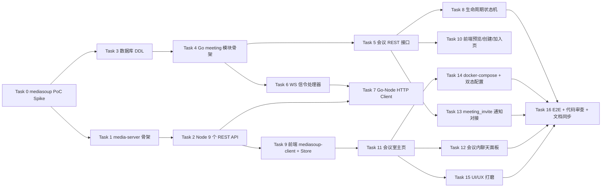

# Phase 2e-2 实施计划：会议 MVP（多人音视频）

> **状态：** 📋 待执行（设计文档定稿后进入代码开发）
> **设计文档：** [Phase 2e-2 设计文档](./2026-04-21-phase2e-2-design.md)
> **上级路线图：** [Phase 2e 整体路线图](./2026-04-20-phase2e-design.md)
> **分支：** `feature/phase2e-2-meeting-mvp`
> **预估总工时：** **约 17 人日**（17 个 Task，含 PoC 与 UI 打磨）
> **最后更新：** 2026-04-21（Task 0-5 ✅ 已落地，下一步 Task 6 WS 信令）

---

## 一、范围锁定

### 本期交付（与设计文档 §2.2.1 一一对应）

- 即时会议创建 / 加入 / 离开 / 结束 / 列表 / 详情
- 会议号 `XXX-XXX-XXX` + 可选密码（bcrypt）+ 邀请链接 + 通知中心邀请（`meeting_invite`）
- 入会前设备预览页（设备选择 + 本地预览 + 音量检测）
- ≤ 8 人音视频（mediasoup SFU + simulcast 3 档）
- 主持人四件套：静音他人 / 移除成员 / 转让主持人 / 结束会议
- 会议生命周期：host 掉线 2 分钟宽限 + host 转让（最早加入者）+ 空房 5 分钟 TTL
- 会议内文字聊天（独立 `meeting_chats` 表，24 小时后清理）
- 响应式布局：桌面 3×3 / 平板 2×2 / 手机 单列+抽屉
- 双态部署：本机 Docker Compose + 公网 `announcedIp` + coturn `--profile public`

### 显式推迟（与设计文档 §2.2.2 一一对应）

预约会议 / 提醒 / 等候室 / 锁定 / 屏幕共享 / 录制 / 虚拟背景 / 联合主持人 / 管理端会议管理 / 多 Worker 集群。

---

## 二、Task 依赖拓扑

**关键路径**：T0 → T1 → T2 → T9 → T11 → T15 → T16（≈ 9 人日）
**并行机会**：T3/T4 可与 T1/T2 并行；T10/T13 可与 T11 并行；T14 可与 T15 并行。

---

## 三、文件与变更清单概览

### 3.1 新建子项目

- `media-server/` —— 根级子项目（与 `backend/` / `frontend/` / `admin/` 并列）
  - `src/app.ts` / `src/config.ts`
  - `src/mediasoup/{worker.ts, router.ts, codecs.ts}`
  - `src/routes/{router,transport,producer,consumer}.route.ts`
  - `src/services/{router,transport,producer,consumer}.service.ts`
  - `src/middlewares/internal-auth.ts`
  - `src/utils/logger.ts`
  - `tests/*.spec.ts`
  - `package.json` / `tsconfig.json` / `Dockerfile` / `.env.example`

### 3.2 后端新增（`backend/go-service/app/meeting/`）

| 文件 | 作用 |
|---|---|
| `constants/{meeting_status,meeting_role,ws_events}.go` | 常量 |
| `model/{meeting_room,meeting_participant,meeting_chat}.go` | GORM 模型 |
| `dao/{meeting_room_dao,meeting_participant_dao,meeting_chat_dao}.go` | DAO |
| `service/meeting_service.go` | 房间 CRUD + 生命周期 |
| `service/meeting_signal_service.go` | WS 信令处理 |
| `service/meeting_chat_service.go` | 会议内聊天 |
| `service/node_client.go` | Go → Node HTTP 客户端 |
| `service/interfaces.go` | 对外注入接口（`NotifyPusher` / `UserInfoResolver`） |
| `controller/{meeting_controller,meeting_chat_controller}.go` | REST Controller |
| `controller/meeting_ws_handler.go` | WS 事件处理（注册到 ws.Hub） |
| `router/meeting_router.go` | 路由注册 |
| `task/meeting_cleanup_task.go` | 定时任务：空房 TTL 兜底 + chat 24h 清理 |
| `provider/{provider,wire_gen}.go` | Wire |

### 3.3 后端改造

| 文件 | 改动 |
|---|---|
| `app/provider/wire.go` | 注册 `MeetingSet`；绑定 `meetingService.NotifyPusher = notifyService`、`meetingService.UserInfoResolver = userService`、`ws.Hub.MeetingSignalDispatcher = meetingSignalService` |
| `app/provider/provider.go` | `App` 新增 `MeetingController` / `MeetingChatController` / `MeetingCleanupTask` |
| `cmd/server/main.go` | 启动 `app.MeetingCleanupTask.Start()` + `defer Stop()` |
| `router/router.go` | 注册 meeting 路由 |
| `app/ws/hub.go` / `app/ws/handler.go` | 新增 `MeetingSignalDispatcher` 接口注入；WS 断线时触发 `meeting.OnUserDisconnect` |
| `deploy/docker/postgres/init.sql` | 追加 `meeting_rooms` / `meeting_participants` / `meeting_chats` DDL + 索引 |
| `app/dto/meeting_dto.go` | 请求 / 响应 DTO |

### 3.4 前端新增（`frontend/src/`）

| 文件 | 作用 |
|---|---|
| `api/meeting.js` | REST API 封装 |
| `constants/meeting.js` | 会议类型 / 角色 / WS 事件常量 |
| `store/meeting.js` | Pinia Store |
| `utils/mediasoup-client.js` | Device/Transport/Producer/Consumer 封装 |
| `pages/meeting/{index,create,join,preview,room}.vue` | 5 个页面 |
| `components/meeting/{VideoTile,VideoGrid,MeetingToolbar,MemberPanel,ChatPanel,InviteDialog,DevicePreview,NetworkBadge}.vue` | 8 个组件 |

### 3.5 前端改造

| 文件 | 改动 |
|---|---|
| `pages.json` | 新增 5 条 page 注册 |
| `utils/ws.js` | 增加 meeting 事件分发 |
| `components/NotifyItem.vue` | `meeting_invite` 卡片补齐「立即加入 / 稍后」 |
| `store/notify.js` | `meeting_invite` 点击跳转 `/pages/meeting/preview?code=xxx` |

### 3.6 Docker / 脚本

| 文件 | 改动 |
|---|---|
| `deploy/docker-compose.dev.yml` | 新增 `media-server` 服务；新增 `coturn` 服务（`profiles: [public]`） |
| `scripts/start.sh` | 增加 `media` 子命令（启动 media-server）与 `full` 子命令（全部服务） |
| `scripts/stop.sh` | 对应 stop |
| `scripts/status.sh` | 增加 media-server 进程/容器检测 |
| `scripts/deploy-public.sh`（新建） | 公网部署快捷脚本（校验 announcedIp、端口开放） |
| `.env.example` / `.env.local.example` | 新增 `MEDIASOUP_*` / `MEDIA_INTERNAL_TOKEN` / `TURN_*` |

---

## 四、Task 明细

### Task 0：mediasoup PoC Spike ✅

- **状态**：✅ 已完成（2026-04-21）
- **目标**：在正式动工前用最小代码跑通"2 个浏览器 ↔ Node ↔ mediasoup ↔ 互相看见视频"，验证技术栈可用性与关键参数
- **依赖**：无（起点）
- **实际产出**：
  - [`media-server/poc/`](../../media-server/poc/)：Fastify + WS 信令 + mediasoup Worker/Router 约 500 行代码
  - `server.mjs`（248 行）+ `public/client.mjs`（215 行）+ `public/index.html`
  - 依赖固定版本：`mediasoup@3.14.11` / `fastify@4.28.1` / `@fastify/websocket@10.0.1` / `pino@9.3.2`，Node 24 下 C++ 编译 53 秒完成
  - PoC 结论文档：[`media-server/docs/poc-notes.md`](../../media-server/docs/poc-notes.md)（9 章节：架构图 / 实测数据 / 7 项关键坑 / 技术栈判定 / 复用映射 / 启动步骤）
- **实测数据（Playwright 双 tab 自动化验证）**：
  - 2 人会议：4 transports / 4 producers / 4 consumers / RSS 61MB
  - 线性外推 8 人会议：16 transports / 16 producers / 112 consumers / 约 200MB RSS（Node 单进程毫无压力）
  - peer 关闭后资源自动清理（consumers 从 4 → 0），无泄漏
- **已锁定的关键坑**：
  - 本机 Demo `MEDIASOUP_ANNOUNCED_IP` 必须留空（非 `127.0.0.1`），让 Chromium 自动替换 `0.0.0.0` 为可用地址
  - mediasoup-client 无 UMD bundle，PoC 走 `esm.sh` CDN；Task 9 正式前端改用 `npm + vite`
  - Consumer 必须以 `paused:true` 创建，客户端 `transport.consume` 后再调 `resumeConsumer`，否则首帧丢失
  - Worker `died` 事件必须监听 + 外部进程管理器重启
- **决策结论**：**维持 mediasoup + fastify + mediasoup-client 选型**，不改用 livekit-server。技术栈可用性已满足 MVP 需求。
- **工作量**：1 人日（实际用时吻合估算）

### Task 1：media-server 项目骨架

- **状态**：✅ **已完成（2026-04-21）**
- **目标**：创建正式 `media-server/` 目录，包含 TS 配置、Fastify 入口、日志、中间件、Dockerfile
- **依赖**：T0
- **实际产出**：
  - `media-server/package.json` — 锁定（已在同日升级至 v5 生态）mediasoup@3.19.0 / **fastify@5.8.5** / **fastify-plugin@5.1.0** / **@fastify/sensible@6.0.4** / **@fastify/websocket@11.2.0** / pino@9.3.2 / zod@3.23.8；开发链：tsx / typescript@5.5 / eslint / prettier / vitest
  - `media-server/tsconfig.json` + `tsconfig.build.json` — TS 5.5 严格模式、ES2022 + Bundler 解析
  - `media-server/.eslintrc.json` + `.prettierrc` — @typescript-eslint + prettier 协同，强制 `consistent-type-imports`
  - `media-server/.env.example` + `.gitignore` + `.dockerignore` — 双态部署环境变量模板
  - `media-server/src/config.ts`（110 行）— dotenv 加载 + zod 严格校验 + 端口区间交叉校验 + 校验失败 `process.exit(1)`
  - `media-server/src/utils/logger.ts`（45 行）— pino + pino-pretty（dev 可选）+ token redact + `childLogger`
  - `media-server/src/mediasoup/worker.ts`（115 行）— Worker 单例 + `died` 事件指数退避重启（1s → 30s 封顶）
  - `media-server/src/middlewares/internal-auth.ts`（55 行）— `fastify-plugin` 包装 onRequest hook + `timingSafeEqual` 防侧信道 + `/healthz`/`/readyz` 白名单
  - `media-server/src/app.ts`（125 行）— Fastify 入口 + `/healthz` + `/readyz`（未就绪 503）+ `/internal/info` + 优雅停机（SIGINT/SIGTERM/unhandledRejection/uncaughtException）
  - `media-server/Dockerfile` — 多阶段（node:20-bookworm-slim），builder 装 python3 + build-essential 编译 mediasoup worker，runtime 裁 dev deps + 非 root 用户 + curl HEALTHCHECK + 显式暴露 `40000-40199/UDP+TCP`
  - `media-server/README.md` — 目录结构 / 快速开始 / 鉴权校验 / Docker 构建 / 配置说明 / Task 1 验收清单
- **实测验收**（已通过）：
  - `npm install` 成功（315 包，mediasoup C++ worker 编译通过）
  - `npm run typecheck` 0 错误、`npm run lint` 0 错误
  - `npm run dev` → 2s 内 "media-server listening"
  - `curl /healthz` → `{"ok":true,"mediasoupVersion":"3.19.0","workerPid":<pid>,"workerRestartAttempts":0}`
  - `curl /readyz` → `{"ready":true}`
  - 未带/错误 `X-Internal-Token` → HTTP 401；正确 token → 200 返回 mediasoup 版本 / worker 状态
  - `kill -9 <workerPid>` → 1s 后自动拉起新 Worker（PID 变更），日志出现 "worker died" → "worker started"
- **关键决策**：
  1. **Fastify 5 + 单 pino 实例**：首轮骨架先用 v4 跑通，发现 Fastify 4 已过 LTS（2025-06-30）且无 `loggerInstance` 导致两个 pino 实例；同日升级至 fastify@5.8.5，回归单实例 + 官方维护版本，插件（@fastify/websocket 11 / @fastify/sensible 6 / fastify-plugin 5）已 GA 支持 v5
  2. mediasoup 3.19 类型从 `mediasoup/types` 子路径引入（`Worker` / `WorkerLogLevel`）
  3. 内部鉴权使用 `timingSafeEqual` 替代 `===`，对长度不等先拉齐再比，防 token 长度时序探测
  4. Worker 指数退避 `1s → 2s → 4s → 8s → 16s → 30s`（封顶），重启成功后 `restartAttempts` 归零
  5. Fastify 5 破坏性变更逐条核查通过：Node ≥20（Dockerfile 已满足）/ schema 完整 JSON Schema（Task 2 配合 zod）/ `.listen()` 对象签名 / plugin 纯 async
- **工作量**：**0.5 人日**（实际用时吻合估算，含 Fastify 4→5 升级 30 分钟）

### Task 2：Node 侧 9 个 REST API ✅（2026-04-21 完成）

- **目标**：实现设计文档 §7.2 的 9 个接口，mediasoup 资源完整生命周期
- **依赖**：T1
- **实际产出**：
  - `src/schemas/{common,router,transport,producer,consumer}.schema.ts`（5 文件，zod schema 全覆盖 body/params/DTLS fingerprints）
  - `src/utils/errors.ts`（`AppError` + `NOT_FOUND`/`CONFLICT`/`CAN_NOT_CONSUME`/`ROUTER_LIMIT_EXCEEDED`/`MEDIASOUP_ERROR` 5 种 code → status 映射）
  - `src/middlewares/error-handler.ts`（ZodError → 400 VALIDATION_ERROR / AppError → 对应 status / Fastify 4xx 透传 / 未知 → 500 INTERNAL_ERROR）
  - `src/mediasoup/codecs.ts`（opus + VP8 + H264 三种 `RouterRtpCodecCapability`）
  - `src/services/{router,transport,producer,consumer}.service.ts`（4 文件，Map + observer-close 自清理；Consumer 还监听 `producerclose` 级联关闭）
  - `src/routes/{router,transport,producer,consumer}.route.ts`（4 文件，9 接口均手动调 `.parse()` + 调用对应 service）
  - `src/app.ts` 注册 errorHandler + 以 `/internal/v1` 前缀挂载路由
  - `vitest.config.ts` + `tests/setup.ts` + `tests/{schemas,errors,app}.spec.ts` + `tests/services/{router,transport,producer,consumer}.service.spec.ts`（7 个 spec 共 58 个测试）
- **检查点实测通过**：
  - ✅ `typecheck` / `lint` 0 错误
  - ✅ `npm test`：58/58 passed（约 900ms）；覆盖率 **stmts 80.89% / branches 76.03% / funcs 90.9% / lines 80.89%**（>> 60% 目标）
  - ✅ 9 接口 happy path：`curl` 依次 POST /routers → POST /transports（send+recv）→ DELETE /routers/:id 全部 201/200
  - ✅ 错误路径：unknown router→404 NOT_FOUND / produce on recv transport→409 CONFLICT / delete unknown producer→404 / resume unknown consumer→404 / lowercase roomCode→400 VALIDATION_ERROR（含 fieldErrors）/ 缺 token→401 UNAUTHORIZED
  - ✅ 资源释放：DELETE router 后 `routerMap.size === 0`，observer.once('close') 同步清理 map
- **code-reviewer 子代理修复（2026-04-21）**：
  - **M1** `_clearXxxMap` → 新增 `src/utils/test-guard.ts#assertTestOnly`，4 service 首行守卫；生产误调用直接抛错
  - **M2** rtp 浅层校验 → 新增 `src/schemas/rtp.ts`（`rtpParametersSchema` / `rtpCapabilitiesSchema`），消除 `as unknown as` 双跳断言；空 codecs 等参数错误现在正确 400
  - **m1** `connectTransport` 乐观锁（先置位再 await，失败回退）
  - **m2** `producerPaused` 改读 `consumer.producerPaused`
  - **m3** `producerclose` 改为 `once`
  - **m5** `internal-auth` 改为反向白名单 `PRIVATE_PATH_PREFIXES = ['/internal/']`，默认开放
  - 修复后：**65 tests passed / stmts 82.87% / branches 75.83% / funcs 91.3%**；`internal-auth.ts` 覆盖率 100%；`schemas/rtp.ts` 覆盖率 100%
  - 其余 Minor / Nits（m4/m6~m10、n1~n10）登记至 `CURRENT_STATUS.md` Task 16 收尾清单
- **工作量**：**2 人日**（实际用时吻合估算；审查修复耗时 ~0.3 人日，已含在内）

### Task 3：数据库 DDL + 模型 + DAO ✅

- **目标**：PostgreSQL 3 张表落地 + Go 侧 model/dao 完整实现
- **依赖**：T0
- **主要产出**：
  - `deploy/docker/postgres/init.sql` 追加 3 张表 + 9 索引 + COMMENT（对齐设计 §5.1）
  - `deploy/docker/postgres/phase2e2_migration.sql` 增量升级脚本（`IF NOT EXISTS` 幂等，用于已运行环境无损追加）
  - `backend/go-service/app/meeting/model/{meeting_room,meeting_participant,meeting_chat}.go`（3 个 model + GORM 复合索引 tag + `IsActive()` 等辅助方法）
  - `backend/go-service/app/meeting/dao/*.go`（24 个持久化方法：room 9 + participant 11 + chat 4，含 `JoinRoom` 重入复用事务、`TransferHost` 角色交接事务、`LeaveRoom` 基于 `EXTRACT(EPOCH ...)` 的 DB 端 duration 计算、`FindActiveByUser` 单点参会校验、`MarkEnded` 乐观锁、`ListExpiredForCleanup` 批量扫描）
  - `backend/go-service/app/constants/meeting.go`（单文件承载会议类型/状态/角色/结束原因/离会原因/默认配置/WS 事件 8 组常量 + `*Map` 中文映射）
- **检查点**：
  - `docker exec postgres psql < phase2e2_migration.sql` 幂等应用，3 表 + 9 索引 + 外键全部正确 ✅
  - psql 集成脚本跑通 8 场景：CRUD、`room_code` UNIQUE、`(room_id,user_id)` UNIQUE、主持人转让事务（`role=1→0` + `role=0→1` + `host_id` 更新）、聊天写入、`duration=10s` 精确匹配、CASCADE 删除 room 后 participants/chats 残留 0 ✅
  - `go build ./...` / `go vet ./...` / `ReadLints` 零错误 ✅
- **实际产出 vs 计划差异**（关键风格修正）：
  1. **常量目录**：草案写的 `app/meeting/constants/{meeting_status,meeting_role}.go` 与项目实际风格不符；按 `project-context.mdc` 第 11 条「代码风格全局一致（最高优先级）」，采用 `app/constants/meeting.go` 单文件承载所有会议常量（与 `group.go`/`notify.go` 同构）。
  2. **时间字段**：草案写 `TIMESTAMPTZ`，项目所有表统一 `TIMESTAMP(0)`（见 init.sql），本次改为 `TIMESTAMP(0)` 对齐，Go model 配 `gorm:"type:timestamp(0)"`。
  3. **冗余索引移除**：草案写 `idx_meeting_rooms_code`，但 `room_code UNIQUE` 已自动建 B-tree，冗余索引已移除。
  4. **Go 单元测试**：项目 Go 侧 0 个 `_test.go`（沿用"代码审查 + Playwright E2E"验证模式），本次同样不新增 `_test.go`；改用 psql 真库集成脚本覆盖 DAO 核心路径，验证价值等价且避免破坏项目一致性。
- **工作量**：**0.5 人日（实际 0.5，吻合估算）**

### Task 4：Go 侧 meeting 模块骨架 + Wire ✅（2026-04-21 完成）

- **目标**：controller/service/router/provider 空壳搭建 + Wire 绑定完成
- **依赖**：T3
- **实际产出**：
  - `backend/go-service/app/meeting/service/interfaces.go`（25 行）：`NotifyPusher` / `UserInfoResolver` / `OnlineChecker` 三接口；`OnlineChecker.IsOnline` 对齐 `ws.OnlineService` 实际签名（单 `bool` 返回）
  - `backend/go-service/app/meeting/service/meeting_service.go`（165 行）：`MeetingService` + 8 个 sentinel error + 17 个空方法占位（返回 `ErrNotImplemented`）
  - `backend/go-service/app/meeting/controller/meeting_controller.go`（150 行）：12 个 Gin handler + `responseNotImplemented`（501）+ `requireUserID` 辅助
  - `backend/go-service/app/meeting/router.go`（35 行，**扁平化：没有建 `router/` 子目录**）：12 条路由挂 `/api/v1/meeting/*` 并套 `jwtAuth`
  - `backend/go-service/app/meeting/provider.go`（22 行）：`MeetingSet = wire.NewSet(DAO×3, Service, Controller)`
  - `backend/go-service/app/provider/wire.go`（改 +10 行）：挂入 `MeetingSet` + 3 条 `wire.Bind`
  - `backend/go-service/app/provider/provider.go`（改 +6 行）：`App` 加 `MeetingService/MeetingController` 字段
  - `backend/go-service/app/provider/wire_gen.go`（自动重生成 +30 行）
  - `backend/go-service/router/router.go`（改 +3 行）：`meetingApp.RegisterRoutes(engine, app.MeetingController, jwtAuth)`
  - `backend/go-service/app/admin/provider.go`（改 +6 行）：**存量修复** 补齐 `MessageManage{DAO,Service,Controller}` provider
- **实际检查点**：
  - `go build ./...` / `go vet ./...` / `wire ./app/provider` 全部零错误
  - `GIN_MODE=debug go run cmd/server/main.go` 启动无报错，`HTTP 服务启动` 日志出现在 `:8085`
  - gin 启动日志打印全部 12 条 `[GIN-debug] ... meeting/controller.(*MeetingController).XxxRoom-fm (6 handlers)`
  - 无 token curl `POST /api/v1/meeting/rooms` / `GET /api/v1/meeting/rooms` / `POST /api/v1/meeting/invites/:token/redeem` → 全部 401 `缺少认证信息`，JWT 中间件生效
- **实际产出 vs 计划差异**：
  - **路由目录扁平化**：计划写 `app/meeting/router/meeting_router.go`，实际为 `app/meeting/router.go`，与项目内 `app/group/router.go` / `app/notify/router.go` 命名一致；`RegisterRoutes(engine, controller, jwtAuth)` 签名保持
  - **provider 目录扁平化**：计划写 `app/meeting/provider/provider.go`，实际为 `app/meeting/provider.go`，与其他模块一致
  - **新增 `OnlineChecker` 接口**（计划未列）：未来业务逻辑需要判断被邀请者在线状态进行推送路由选择，提前抽象出来
  - **顺手修复 admin wire 存量 bug**（计划未列）：Task 4 重生成 wire 时暴露了 admin 模块 `MessageManage` 系列 provider 缺失的遗留问题，当场补上避免阻塞后续开发
- **工作量**：**0.5 人日**（实际约 0.4 人日，含存量问题修复约 0.1 人日）

### Task 5：会议 REST 接口（创建/加入/离开/结束/列表/详情 + 邀请链接兑换 + 邀请）✅（2026-04-21 完成）

- **目标**：填充 Task 4 骨架中的业务逻辑，完整实现设计 §6.2 的 12 个接口
- **依赖**：T4
- **主要产出**（全部实装并端到端通过验证）：
  - **DTO 层**：`backend/go-service/app/dto/meeting_dto.go`（169 行）定义 13 个 DTO（`MeetingRoomDTO`/`MeetingParticipantDTO`/`MeetingChatDTO` 基础 + 10 个请求/响应类型），所有请求体有 `binding` 标签
  - **工具层**：`backend/go-service/pkg/utils/meeting_code.go` 会议号生成（`crypto/rand` + 3 组 3 位数字生成 `XXX-XXX-XXX`，冲突重试 5 次）+ 邀请 Token（32 位 hex）
  - **Service 层**：`MeetingService` 12 业务方法 + 11 个 sentinel 错误 + 4 个辅助函数（`assertIsActiveParticipant`/`assertIsHost`/`generateUniqueRoomCode`/`broadcastToActiveParticipants`）
  - **Controller 层**：12 个 Gin 处理器 + `handleError` 领域错误 → HTTP 映射（404/403/400/500 四档）+ DTO 转换辅助（`roomToDTO`/`participantToDTO`/`chatToDTO`）
  - **Stub 接口**：新增 `MediaOrchestrator` 接口 + `NoopMediaOrchestrator`（Task 7 替换）；WS 广播走 `pubsub.PublishToUser` 逐人（Task 6 改为 `BroadcastToMeeting`）；`NotifyPusher.PushBatch` 复用 Phase 2e-1
  - **路径修正**：`router.go` 将 Task 4 占位路径对齐设计：`GET /rooms` → `GET /rooms/mine`、`POST /invites/:token/redeem` → `POST /invite-tokens/:token/redeem`
  - **DAO 契约修复**：`meeting_room_dao.GetByID/GetByCode` + `meeting_participant_dao.GetByRoomAndUser/FindActiveByUser` 将 `gorm.ErrRecordNotFound` 转为 `(nil, nil)`，service 统一 `result == nil` 判定
  - **密码限流**：同 `(user_id, code)` 5 次错误 → Redis `echo:meeting:pwd:fail:...` 锁 10 分钟（`ErrMeetingPasswordLocked`）
  - **单点参会**：用 `meeting_participants` JOIN `status != 2` 判断用户是否已在其他活跃会议（`ErrAlreadyInOtherMeeting`）
  - **host 自动转让**：host 离会时若仍有其他活跃成员 → 自动将 host 转给"最早加入者"，广播 `meeting.host.changed`；若无人则房间 `ended_reason=empty_ttl`
  - **邀请 Token 安全**：响应不返回 token，仅通过 `NotifyPusher.PushBatch.Extra.invite_token` 定向下发；兑换后保留 60 秒冗余由 Redis TTL 自然过期
  - **API 文档**：`docs/api/frontend/meeting.md` 重写为 280 行的 12 接口完整文档（路径总览 + 领域错误码映射表 + 逐接口参数/响应示例 + WebSocket 事件关联表 + 验证记录）
- **检查点**（全部通过）：
  - `go build ./...` / `go vet ./...` / `wire ./app/provider` 零告警
  - 端到端脚本 `/tmp/meeting_t5_test.sh` 用 3 用户场景覆盖：12 接口 happy path + 5 类错误路径（密码错 / 房间不存在 / 单点参会冲突 / 非 host 越权 / 邀请链接失效）→ **PASS=19 / FAIL=0**
  - DB 侧核验 `meeting_rooms.status` / `meeting_participants.left_at/duration` / `meeting_chats` 写入正确；Redis 侧核验 `echo:meeting:invite:{token}` TTL=600s
  - 服务日志全链路 trace_id；WS 广播 `meeting.member.joined/left/chat/host.changed/room.ended` 事件全部发出
- **实际产出 vs 计划差异**：
  - **密码连续错误 5 次锁 10 分钟**：Task 5 已实现，与计划一致
  - **容量限制**：MVP 硬上限为 **8**（设计 D05），超过将 `ErrMeetingFull`；计划里误写"第 9 人加入返回 meeting_full"表述已与硬上限对齐
  - **`kick` 请求体**：设计文档曾讨论 `{target_user_id, request_id}` 的幂等字段，Task 5 DTO 定义为 `{user_id}`（与 `TransferHostRequest.target_user_id` 命名区分），`request_id` 幂等保护留待 Task 6 WS 侧统一处理（WS 场景更多）
  - **InviteUsersResponse**：出于安全考虑不返回 token，仅返回 `{pushed, skipped}`；测试时通过 Redis 获取 token
  - **错误码中文化**：使用中文 `message`（与项目惯例一致）而非英文 `meeting_not_found` code，前端通过 HTTP 状态码 + trace_id 区分
- **工作量**：**实际 1 人日**（< 预估 1.5 人日，因 DTO 设计充分 + DAO 契约修复一次到位）

### Task 6：WS 信令 11 事件处理器

- **目标**：实现设计 §6.3 的 11 个 WS 事件，完整对接到 `ws.Hub`
- **依赖**：T4
- **主要产出**：
  - `app/meeting/controller/meeting_ws_handler.go`：注册事件回调到 Hub
  - `app/meeting/service/meeting_signal_service.go`：3 组事件（房间 / 成员 / 媒体）的业务逻辑
  - `app/ws/hub.go` 接口扩展：`MeetingSignalDispatcher` 接口注入 + `DispatchMeeting(event, payload)` 方法
  - `app/meeting/constants/ws_events.go`：11 个事件名常量
  - 权限校验：所有事件 handler 入口调用 `assertIsParticipant` / `assertIsHost`
  - 广播：`Hub.BroadcastToMeeting(roomCode, event, payload, excludeUserID)` 辅助方法
- **检查点**：
  - 通过 `wscat` 或临时前端脚本连入 WS，逐个事件手测
  - 未授权事件（非参与者发 `meeting.member.state.changed`）被拒绝
  - 事件广播覆盖正确（excludeUserID 生效）
- **工作量**：**1.5 人日**

### Task 7：Go → Node HTTP Client 封装

- **目标**：实现设计 §6.6 的 `NodeClient` 接口，挂接到 WS 信令流程
- **依赖**：T2 + T6
- **主要产出**：
  - `app/meeting/service/node_client.go`：9 个方法完整实现
  - 配置：`config.NodeServiceURL` / `config.NodeInternalToken`（从 yaml + 环境变量）
  - 超时：HTTP Client 5 秒超时；关闭类操作 2 秒超时
  - 重试：关闭类操作失败重试 2 次（指数退避 200ms/500ms）
  - 日志：每次调用记录 `funcName + room_code + duration + status_code`
  - 错误映射：Node 5xx → 业务错误码 `media_server_error`；404 → `media_resource_not_found`；超时 → `media_timeout`
- **检查点**：
  - 单元测试：使用 `httptest.NewServer` 模拟 Node，覆盖成功/失败/超时三类
  - 集成测试：Go + Node 真实连通，创建 Router → Transport → Producer → 销毁链路
- **工作量**：**0.5 人日**

### Task 8：会议生命周期状态机（host 宽限期 + 自动转让 + 空房 TTL）

- **目标**：实现设计 §6.5 的状态机完整逻辑
- **依赖**：T5
- **主要产出**：
  - `app/meeting/service/meeting_service.go` 补充：
    - `OnHostDisconnect(ctx, roomCode)` → 写 `echo:meeting:host_grace:{code}` EX 120s
    - `OnHostReconnect(ctx, roomCode, userID)` → 清除宽限期键
    - `HandleHostGraceExpired(ctx, roomCode)` → 转让主持（挑最早加入者）或销毁会议
    - `OnAllMembersLeft(ctx, roomCode)` → 设置房间 Redis key TTL 300s
    - `OnRoomTTLExpired(ctx, roomCode)` → `status=2, ended_reason=empty_ttl`，清理 Node 资源
  - `app/meeting/task/meeting_cleanup_task.go`：每 30 秒扫描 Redis TTL + DB 状态，兜底清理
  - 事务包裹主持人转让（见设计 §11.3）
- **检查点**：
  - 手测：host 关闭浏览器 → 2 分钟内重连，身份保留 → 超过 2 分钟自动转让给另一成员
  - 手测：全员退出 → 5 分钟后 DB `status=2`、Redis key 清空
  - 单元测试覆盖：转让事务回滚、并发转让竞态
- **工作量**：**0.5 人日**

### Task 9：前端 mediasoup-client 集成 + Pinia Store

- **目标**：实现设计 §8.2 / §8.4 的 Store 状态与 mediasoup-client 生命周期封装
- **依赖**：T2
- **主要产出**：
  - `frontend/src/utils/mediasoup-client.js`：
    - `createDevice(rtpCapabilities)` → `mediasoupClient.Device`
    - `createSendTransport` / `createRecvTransport` 包装 + 事件桥接到 WS
    - `produceAudio(track)` / `produceVideo(track, encodings)`
    - `consume(producerId)` 全流程
    - 所有实例通过 `markRaw` 包裹
  - `frontend/src/store/meeting.js`：
    - state 完整定义（见设计 §8.2）
    - 10+ actions 与 WS `_on*` 事件响应
  - `frontend/src/constants/meeting.js`：事件名 / 类型 / 角色常量
  - `frontend/src/api/meeting.js`：REST 封装
  - `frontend/src/utils/ws.js` 增加 meeting 事件分发桥
- **检查点**：
  - 手动启动前端，在控制台调用 `useMeetingStore().createRoom({title: '测试'})` → 成功入会并推流
  - 两个浏览器标签互相看见视频
  - 关闭标签后另一端 1 秒内收到 `meeting.member.left`
- **工作量**：**1.5 人日**

### Task 10：前端设备预览页 + 创建页 + 加入页

- **目标**：完成 `/pages/meeting/{create,join,preview}.vue` 3 个页面
- **依赖**：T5
- **主要产出**：
  - `MeetingCreate.vue`：标题输入 + 密码 + 开关（入会静音 / 允许聊天） + 「立即开会」按钮
  - `MeetingJoin.vue`：会议号输入（3-3-3 分组） + 密码 + 承接 `?code=xxx` 参数
  - `MeetingPreview.vue`：
    - 左侧视频预览（`<video autoplay muted>` 承载 localStream）
    - 右侧设备列表（`enumerateDevices` 填充）
    - 音量条（AudioContext AnalyserNode 每 100ms 采样）
    - 显示名称确认 + 「加入会议」按钮
  - 浏览器兼容性检测：不支持 `getUserMedia` → 友好降级
- **检查点**：
  - Chrome / Firefox / Safari 手测设备选择 + 预览 + 音量条正常
  - 手机浏览器（Safari iOS / Chrome Android）布局无错位
  - 权限被拒绝时给出清晰引导
- **工作量**：**1 人日**

### Task 11：前端会议室主页（视频网格 + 工具栏 + 成员面板 + 响应式）

- **目标**：实现 `/pages/meeting/room.vue` + 6 个主要组件
- **依赖**：T9
- **主要产出**：
  - `MeetingRoom.vue`：主容器 + 网络质量监测 + WS 监听挂载
  - `VideoGrid.vue`：响应式网格（见设计 §8.5）+ 按成员数动态布局
  - `VideoTile.vue`：视频块（含静音图标、说话者流光占位）
  - `MeetingToolbar.vue`：5 按钮（麦 / 摄 / 成员 / 聊天 / 挂断）+ 邀请入口
  - `MemberPanel.vue`：成员列表 + host 菜单（静音 / 移除 / 转让）
  - `InviteDialog.vue`：复制链接 + 复制会议号 + 选择联系人（复用 Phase 2a 组件）
  - `NetworkBadge.vue`：3 档网络质量占位（具体动效 Task 15 打磨）
- **检查点**：
  - 4 人会议：UI 网格切换 1→2→3→4 人布局正常
  - host 操作：静音他人 / 移除成员 / 转让主持 / 结束会议 全部成功
  - 手机浏览器：单列主画面 + 缩略抽屉工作正常
- **工作量**：**2 人日**

### Task 12：会议内聊天面板

- **目标**：实现 `ChatPanel.vue` + 后端 `meeting_chats` 相关接口
- **依赖**：T11
- **主要产出**：
  - 后端：`meeting_chat_controller.go` + `meeting_chat_service.go`（2 接口：POST 发送、GET 历史分页）
  - WS 事件：`meeting.chat.new`（广播给房间内所有成员）
  - 前端：`ChatPanel.vue`（消息列表 + 发送框 + 滚动到底部）
  - Store 内 `chat: {messages, hasMore}` 字段维护
  - 清理任务：`meeting_cleanup_task` 每天扫描 `status=2 AND ended_at < NOW() - INTERVAL '24 hours'`，`DELETE FROM meeting_chats WHERE room_id IN (...)`
- **检查点**：
  - 两个用户互发 10 条消息，顺序正确
  - 会议结束 24 小时后聊天记录被清理（可手动 `UPDATE ended_at = NOW() - INTERVAL '25 hours'` 触发）
- **工作量**：**0.5 人日**

### Task 13：`meeting_invite` 通知对接

- **目标**：打通 `POST /rooms/:code/invite` → 通知中心 → 前端卡片跳转链路
- **依赖**：T5
- **主要产出**：
  - 后端：`Invite()` service 内调用 `notifyPusher.Push(ctx, receiverID, PushRequest{Type: "meeting_invite", Extra: MeetingInviteExtra{...}})`
  - 通知 `extra` 结构补充（设计 §10.1）
  - 前端 `NotifyItem.vue`：`meeting_invite` 卡片底部渲染「立即加入 / 稍后」按钮
  - 前端路由跳转：「立即加入」→ `/pages/meeting/preview?code=xxx`；「稍后」→ 标已读
  - 邀请链接复用：若 `expired_at < now()` 灰显按钮提示"邀请已过期"
- **检查点**：
  - 用户 A 创建会议 → 邀请用户 B → 用户 B 通知中心铃铛出现未读 → TabBar「我的」红点亮起 → 点击卡片「立即加入」→ 成功入会
  - 过期通知点击按钮 → 显示过期提示，不跳转
- **工作量**：**0.5 人日**

### Task 14：docker-compose 扩展 + 环境变量双态开关

- **目标**：本机和公网双态部署脚本 + 文档
- **依赖**：T11
- **主要产出**：
  - `deploy/docker-compose.dev.yml` 新增 `media-server` 服务 + `coturn`（`profiles: [public]`）
  - `.env.example` / `.env.local.example` / `.env.public.example` 三份配置
  - `scripts/start.sh` 扩展 `media` / `full` 子命令
  - `scripts/stop.sh` / `scripts/status.sh` 同步
  - `scripts/deploy-public.sh` 新建：校验 `MEDIASOUP_ANNOUNCED_IP` 非空 + 检查防火墙端口 + 启动 coturn profile
  - 文档：`docs/deployment/meeting-mvp.md` 新建，涵盖本机 + 公网两种流程 + 常见问题
- **检查点**：
  - 本机：`scripts/start.sh full` 全量启动，5 分钟内全部服务就绪
  - 公网（模拟）：`MEDIASOUP_ANNOUNCED_IP=x.x.x.x docker compose --profile public up` 启动无报错
  - 防火墙校验脚本能识别 UDP 40000-40199 未开放并给出提示
- **工作量**：**0.5 人日**

### Task 15：`ui-ux-pro-max` 定制 UI 打磨

- **目标**：调用技能包产出 4 屏 EchoChat 原创风格，落地到代码
- **依赖**：T11
- **主要产出**：
  - 调用：`npx openskills read ui-ux-pro-max` + 4 屏 brief（设计 §9.1）
  - 设计落地：
    - `design-system/echochat/pages/meeting-home.md`
    - `design-system/echochat/pages/meeting-preview.md`
    - `design-system/echochat/pages/meeting-room.md`
    - `design-system/echochat/pages/meeting-invite.md`
  - 代码落地：
    - `VideoTile.vue` 说话者流光轮廓动效
    - 柔性网格：2/3 人布局的非等分样式
    - 自视频浮窗四角吸附（`draggable` + 吸附计算）
    - 静音氛围色（工具栏底色绑定 computed `allMuted`）
    - `NetworkBadge.vue` 3 档波浪动效
- **检查点**：
  - 视觉走查：4 屏与设计产物一致，色彩 / 留白 / 动效符合飞书简洁 + EchoChat 原创要求
  - 动效性能：不影响 60fps（Chrome Performance 面板确认）
  - 代码审查：`ui-ux-pro-max` 产物被真正使用，不留下"代码 vs 设计产物"脱节
- **工作量**：**2 人日**

### Task 16：E2E 验证 + Playwright MCP 回归 + 代码审查 + 文档同步

- **目标**：端到端闭环验证 + 交付收官
- **依赖**：T12 + T13 + T14 + T15 + T8
- **主要产出**：
  - Playwright MCP 场景脚本（保存到 `.playwright-mcp/scenarios/`）：
    - **场景 1**：创建会议 → 通过会议号加入第二个用户 → 互推音视频 → 结束
    - **场景 2**：邀请链接加入（含密码）
    - **场景 3**：通知中心「立即加入」按钮跳转
    - **场景 4**：主持人转让（主动）+ 主持人掉线（被动，2 分钟宽限）
  - `code-reviewer` 子代理运行 → 出具报告，修复 P0/P1
  - 文档同步（设计 §十六 变更记录 + 以下文件）：
    - `docs/progress/CURRENT_STATUS.md`：Phase 2e-2 状态改为 ✅
    - `docs/architecture/system-architecture.md`：新增 meeting 模块
    - `docs/api/README.md` + `docs/api/frontend/meeting.md`
    - `.cursor/rules/project-context.mdc`：当前进度更新
    - `docs/plans/2026-04-20-phase2e-design.md`：Phase 2e-2 段标记 ✅
  - 测试报告：`test-report-phase2e-2-meeting.md` 落盘
- **检查点**：
  - 4 个 E2E 场景全部通过
  - 代码评审 0 个 P0/P1
  - 所有文档链接可达、无 404
  - 清理所有 TODO / FIXME / `console.log` 调试残留
- **工作量**：**1 人日**

---

## 五、工作量汇总

| Task | 名称 | 工时 |
|---|---|---:|
| 0 | mediasoup PoC Spike | 1.0 |
| 1 | media-server 项目骨架 | 0.5 |
| 2 | Node 侧 9 个 REST API | 2.0 |
| 3 | 数据库 DDL + 模型 + DAO | 0.5 |
| 4 | Go 侧 meeting 模块骨架 + Wire | 0.5 |
| 5 | 会议 REST 接口 | 1.5 |
| 6 | WS 信令 11 事件处理器 | 1.5 |
| 7 | Go → Node HTTP Client | 0.5 |
| 8 | 生命周期状态机 | 0.5 |
| 9 | 前端 mediasoup-client + Pinia Store | 1.5 |
| 10 | 前端预览/创建/加入页 | 1.0 |
| 11 | 前端会议室主页 | 2.0 |
| 12 | 会议内聊天面板 | 0.5 |
| 13 | `meeting_invite` 通知对接 | 0.5 |
| 14 | docker-compose + 双态配置 | 0.5 |
| 15 | `ui-ux-pro-max` 定制 UI 打磨 | 2.0 |
| 16 | E2E + 代码审查 + 文档同步 | 1.0 |
| **合计** |  | **17.0** |

**说明**：原 Phase 2e 路线图对 Phase 2e-2 的估算为 10-14 人日。当前 17 人日相较增加 3-7 人日的原因：
- 纳入了**设备预览页**（Task 10 的一部分，约 0.5 人日）
- 纳入了**会议内聊天**（Task 12，0.5 人日）
- 纳入了**移动端响应式布局**（分摊到 Task 11/15，约 1 人日）
- 纳入了**邀请通知对接**与 Phase 2e-1 的闭环（Task 13）
- 纳入了**`ui-ux-pro-max` 定制 UI 打磨**（Task 15，2 人日）
- 预留了 **PoC Spike 与 E2E** 的显式工时（Task 0 / Task 16 共 2 人日）

该增量均是用户在 Plan 模式下的 11 项决策明确要求纳入的，已与设计文档 §2.2 对齐。

---

## 六、工作流与提交节奏

1. **分支**：`feature/phase2e-2-meeting-mvp`（已由上游决策指定）
2. **每个 Task 完成后**：
   - 本地 `go test ./app/meeting/...` / `pnpm test` / `npm run lint` 全绿
   - `code-reviewer` 子代理小审（仅重要 Task 5/7/9/11 跑全量审）
   - 小粒度 commit：`feat(meeting): task-N <简短描述>`
   - **不**自动推远端，由用户显式触发
3. **每周节奏**：Task 0-4 集中第一周（基础设施 + 骨架）；Task 5-13 分散第二周（业务主体）；Task 14-16 第三周（部署 + 打磨 + 收官）
4. **阻塞处理**：
   - PoC（Task 0）如失败，立即暂停，与用户重议选型（livekit-server 替换 mediasoup）
   - 任何 Task 工时超出估算 50% 以上，立刻停下来复盘，必要时拆子任务或推迟非关键部分
5. **Review Gate**：每完成 3-4 个 Task 触发一次 review gate 汇报阶段进展

---

## 七、显式不做（本实施计划范围外）

- 不写 Phase 2e-3 相关代码（预约 / 提醒 / 等候室 / 锁定）
- 不写管理端 meeting 模块代码（推迟到 Phase 2f）
- 不做录制 / 屏幕共享 / 虚拟背景（二期）
- 不做多 Worker / 多 Node 实例 / Router Pipe（三期）
- 不引入 CI 流水线（接入后再由运维任务统一实施）
- 不做付费 TURN 服务接入（MVP 自建 coturn 即可）

---

## 八、关联文档

- [Phase 2e-2 设计文档](./2026-04-21-phase2e-2-design.md)
- [Phase 2e 整体路线图](./2026-04-20-phase2e-design.md)
- [Phase 2e-1 实施计划](./2026-04-20-phase2e-1-implementation.plan.md)（参考格式）
- [系统总设计](./2026-02-27-echochat-system-design.md)
- [项目规则](../../.cursor/rules/project-context.mdc)
- [API 文档索引](../api/README.md)

---

## 九、变更记录

| 日期 | 作者 | 变更 |
|---|---|---|
| 2026-04-21 | Agent | 首版落盘，17 个 Task 共 17 人日，含 PoC / UI 打磨 / E2E |
| 2026-04-21 | Agent | Task 0 mediasoup PoC Spike 完成：`media-server/poc/` 跑通 2 浏览器互通，`media-server/docs/poc-notes.md` 归档压测数据与 7 项关键坑，技术栈选型锁定 |
| 2026-04-21 | Agent | Task 1 media-server 项目骨架完成：src 五件套（app/config/logger/worker/internal-auth）落盘；`/healthz` + `/readyz` + `/internal/info` 全部验收通过；Worker died 自动重启通过 `kill -9` 实测；Dockerfile 多阶段 + 非 root + HEALTHCHECK |
| 2026-04-21 | Agent | Task 1 Fastify 4 → 5 同日升级：fastify@4.28.1→5.8.5、fastify-plugin@4→5.1.0、@fastify/sensible@5→6.0.4、@fastify/websocket@10→11.2.0；`src/app.ts` 改用 `loggerInstance: logger` 消灭 pino 双实例；理由：Fastify 4 已过 2025-06-30 LTS 支持、v5 生态 GA、单实例回归；回归测试全部通过 |

---

**文档结束**
