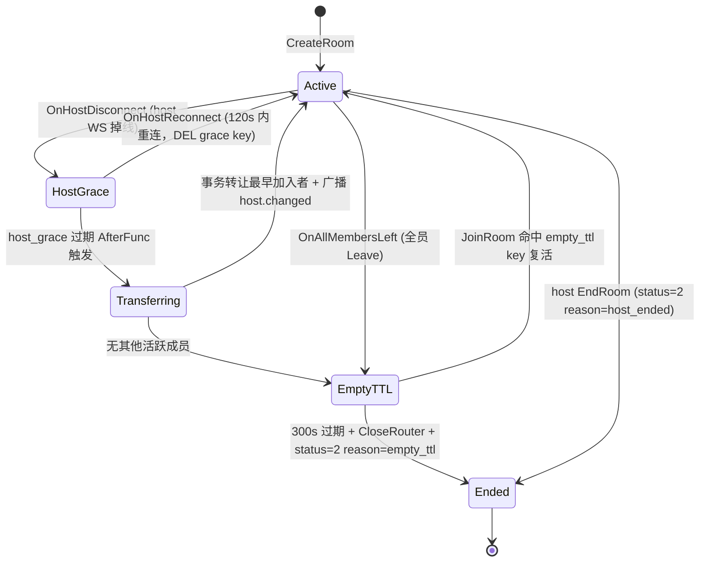

## 一、核心决策（回答已确认）

- **普通成员 WS 断线（Q1=A）**：维持现状，仅清 WS 媒体资源，不动 `meeting_participants`；长期不活跃依赖 4h 兜底清理（Task 8 内实现）
- **Router 去重（Q2=C）**：业务层 `JoinRoom` 不再调 `CreateRouter` + `HTTPMediaOrchestrator.CreateRouter` 加 sync.Map 幂等防御
- **过期检测**：`time.AfterFunc` 为主（低延迟）+ 后台 `meeting_cleanup_task` 每 30s 扫描兜底（服务重启/机器迁移场景）
- **并发保护**：`HandleHostGraceExpired` 入口先 `DEL` host_grace key，DEL 返回 0 视为已被重连清走，直接 return（天然互斥）
- **可测性**：`config.MeetingConfig{HostGraceSeconds, EmptyRoomTTLSeconds, CleanupIntervalSeconds}`，默认 120/300/30，E2E 测试可覆盖为 2/3/1

## 二、状态机流转



## 三、文件变更清单

### 3.1 新建

- [`backend/go-service/app/meeting/service/meeting_lifecycle_service.go`](../../backend/go-service/app/meeting/service/meeting_lifecycle_service.go)（约 350 行）
  - 统一封装 5 个钩子：`OnHostDisconnect / OnHostReconnect / HandleHostGraceExpired / OnAllMembersLeft / HandleEmptyRoomExpired`
  - 内部 `sync.Map[roomCode]*time.Timer` 管理本地 AfterFunc
  - 暴露 `RescheduleFromRedis(ctx)`（服务启动时扫描已存在的 grace/empty_ttl key 补装 timer）
- [`backend/go-service/app/meeting/task/meeting_cleanup_task.go`](../../backend/go-service/app/meeting/task/meeting_cleanup_task.go)（约 180 行）
  - 启动时先 `lifecycleSvc.RescheduleFromRedis` 一次
  - 每 30s：扫 `echo:meeting:host_grace:*` 找出 `TTL ≤ 0` 或 timer 已丢失的 key → 再次触发 `HandleHostGraceExpired`；同理处理 `empty_ttl` key
  - 每 10 分钟：`roomDAO.ListStaleActive(hoursNoActivity=4)` → `EndRoom(..., reason=system_error)` 兜底
  - 每 24 小时：`chatDAO.DeleteByRoomIDs(olderThan=24h)` 聊天清理
- [`docs/verify/meeting_t8_verify.mjs`](../verify/meeting_t8_verify.mjs)（约 250 行）E2E 脚本

### 3.2 修改（业务逻辑）

- [`backend/go-service/app/meeting/service/meeting_service.go`](../../backend/go-service/app/meeting/service/meeting_service.go)
  - `JoinRoom` L307-316：**移除** `mediaOrchestrator.CreateRouter` 调用，改为复用已存在 Router（查 Redis `echo:meeting:room:{code}` router_id 字段或直接从 HTTPMediaOrchestrator sync.Map 读）
  - `LeaveRoom` L381-384：全员退出时从"立即 MarkEnded+CloseRouter"改为**调 `lifecycleSvc.OnAllMembersLeft(ctx, code)`**
  - `JoinRoom` 新增 L260 后：检查 `echo:meeting:empty_ttl:{code}` 存在即 `lifecycleSvc.CancelEmptyTTL(ctx, code)` 恢复房间
  - `CreateRoom` L213 保留（房间首创 Router）
- [`backend/go-service/app/meeting/service/http_media_orchestrator.go`](../../backend/go-service/app/meeting/service/http_media_orchestrator.go)
  - `CreateRouter` 前置查 `roomRouterCache` sync.Map，命中即直接 return（底层幂等防御，对业务层误调零影响）
- [`backend/go-service/app/meeting/service/meeting_signal_service.go`](../../backend/go-service/app/meeting/service/meeting_signal_service.go)
  - 新增公开方法 `OnWSDisconnect(ctx context.Context, userID int64)`：`participantDAO.FindActiveByUser` → 存在则调 `cleanupUserResources`；若 `room.HostID == userID` 则额外 `lifecycleSvc.OnHostDisconnect`
  - `OnRoomJoin` 新增 L112 前：若该用户是 room.HostID 则调 `lifecycleSvc.OnHostReconnect`（支持主持人重连恢复）

### 3.3 WS 断线钩子集成

- [`backend/go-service/app/ws/handler.go`](../../backend/go-service/app/ws/handler.go)
  - 新增字段 `meetingDisconnectHook MeetingDisconnectHook`（接口，可选，避免循环依赖）
  - `SetOnDisconnect` 回调 L115-123：在 `UserOffline` 之后追加 `hook.OnWSDisconnect(ctx, userID)`
- `app/ws/interfaces.go`（新增 10 行）定义接口：
  ```go
  type MeetingDisconnectHook interface {
      OnWSDisconnect(ctx context.Context, userID int64)
  }
  ```
- `app/provider/wire.go`：`wire.Bind(new(ws.MeetingDisconnectHook), new(*service.MeetingSignalService))`

### 3.4 配置 + 启动

- [`backend/go-service/config/config.go`](../../backend/go-service/config/config.go) 新增 `MeetingConfig { HostGraceSeconds int; EmptyRoomTTLSeconds int; CleanupIntervalSeconds int; StaleRoomHours int }`
- `config.dev.yaml` / `config.docker.yaml` 默认值：120 / 300 / 30 / 4
- `cmd/server/main.go` L82 后追加：`app.MeetingCleanupTask.Start()` + `defer Stop()`
- `app/provider/provider.go`：`App` 结构体新增 `MeetingCleanupTask *task.MeetingCleanupTask`

### 3.5 DAO 扩展

- [`backend/go-service/app/meeting/dao/meeting_room_dao.go`](../../backend/go-service/app/meeting/dao/meeting_room_dao.go)
  - `ListStaleActive(ctx, hoursNoActivity int, limit int) ([]int64, error)`：`status != ended AND started_at < NOW() - hoursNoActivity`
  - `FindActiveByCode(ctx, code) (*MeetingRoom, error)`（若不存在直接复用已有 GetByCode）

### 3.6 Redis key 增补

| key | TTL | 值 | 作用 |
|---|---|---|---|
| `echo:meeting:host_grace:{code}` | 120s | `{host_id, grace_until, started_at}` JSON | 已在设计 §5.4 定义，Task 8 落地 |
| `echo:meeting:empty_ttl:{code}` | 300s | `1`（占位） | 空房 TTL key（设计 §5.4 `echo:meeting:room:{code}` 的 TTL 语义，本 Task 改为独立 key 语义更清晰） |
| `echo:meeting:grace_lock:{code}` | 5s | `1` | SETNX 锁，防止多实例部署并发处理同一过期事件（可选，MVP 单实例不强依赖） |

## 四、并发/容错要点

1. **host 重连与过期竞争**：`HandleHostGraceExpired` 入口先 `DEL host_grace` + 检查返回值；返回 0 即已被 `OnHostReconnect` 清走，跳过本次处理
2. **AfterFunc 取消**：`lifecycleSvc` 的 `sync.Map` 存 `*time.Timer`，`OnHostReconnect` / `CancelEmptyTTL` 时调 `timer.Stop()` + `sync.Map.Delete`
3. **服务重启兜底**：`RescheduleFromRedis` 扫 `SCAN echo:meeting:host_grace:*` 和 `echo:meeting:empty_ttl:*`，按 `PTTL` 剩余毫秒数重新 AfterFunc
4. **TransferHost 事务幂等**：DAO 层已是事务；外层在 DEL grace_key 成功后才调 TransferHost，天然串行
5. **4 小时兜底 EndRoom**：`cleanupTask` 用独立 context.Background + 5min timeout，失败仅日志不 panic

## 五、测试/验收

- 单元：psql 手工脚本验证 `TransferHost` 事务在冲突时回滚（复用 Task 3 风格）
- E2E 脚本 [`docs/verify/meeting_t8_verify.mjs`](../verify/meeting_t8_verify.mjs)（TEST 模式下 `HostGraceSeconds=2`、`EmptyRoomTTLSeconds=3`、`CleanupIntervalSeconds=1`）：
  1. host 掉线 → 2s 内读 `host_grace` 存在 → 第二成员 3s 后收 `meeting.host.changed`，room.HostID 在 DB 已更新
  2. host 掉线 → 1s 内重连 → `host_grace` 被 DEL → host 身份保留
  3. 全员 leave → `empty_ttl` 存在 → 新用户 join → key 被 DEL + 房间 status 仍 Active
  4. 全员 leave → 不 join → 3s 后 MarkEnded + CloseRouter（Node 日志印证）
  5. JoinRoom 两次不再产生两次 `router created` Node 日志（Task 7 遗留修复验收）
- `go build ./... && go vet ./...` 全绿，ReadLints 零问题

## 六、文档同步（commit 前）

- `docs/progress/CURRENT_STATUS.md` 新增 Task 8 章节，总进度切 `Task 0-8 ✅ / Task 9-16 待执行`
- `docs/plans/2026-04-21-phase2e-2-implementation.plan.md` Task 8 标记已完成 + 实际产出
- `docs/plans/2026-04-21-phase2e-2-design.md` §十六变更记录追加 Task 8 偏差（若有）
- `docs/api/frontend/meeting.md` 补充 host 宽限期 UI 建议 + 空房复活行为
- `.cursor/rules/project-context.mdc` 进度同步

## 七、风险与回退

- 本地 timer 失效（宿主时钟跳变）→ 30s 扫描兜底接管
- 多实例部署并发处理同一过期事件 → MVP 单实例可容忍，后续用 `grace_lock` SETNX 修复
- JoinRoom 移除 CreateRouter 后如果 Router 丢失（Node 重启）→ HTTPMediaOrchestrator 层可加"404 → 重建"兜底（作为 Task 8 可选增强或 Task 16 再议）
